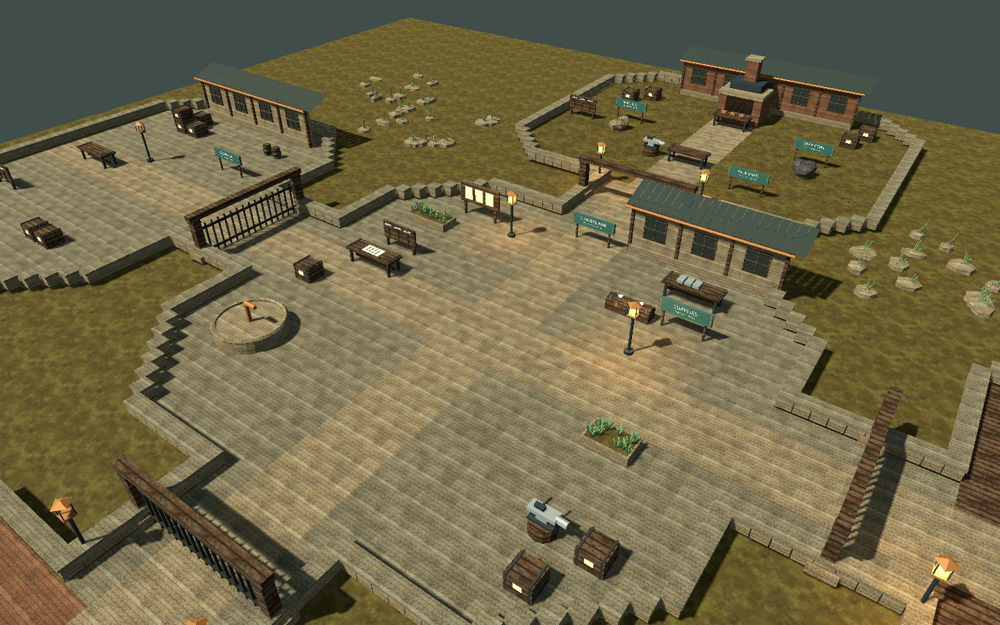
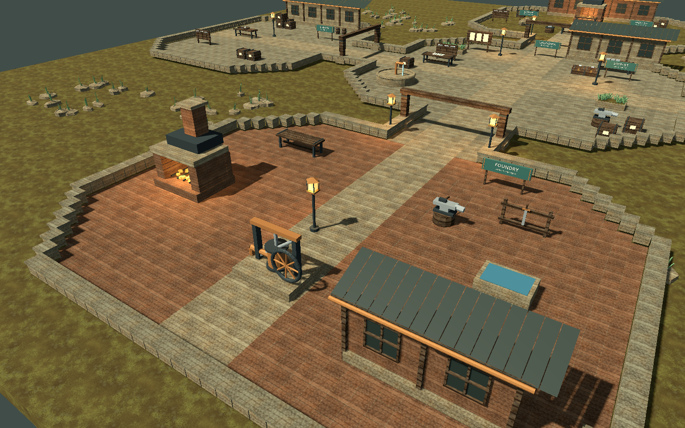

# Cinderbank environment polish

The Broken Workshop now uses its own environment kit in the native client. This is the first visual quality pass for the six follow-up tutorials; it does not mark all six maps or the full storyboard vision as finished.

## Play

Run the updated client and `dev-server`, then choose **Help → Practice adventures → The Broken Workshop**, or enter `#tutorial crafting`. An existing checkpoint resumes. The first core playthrough begins with a cold workshop; completed optional exercises use the restored workshop.

## What changed

- Chamfered courts, pale circulation paths, an earthen raw yard, timber reading-room floors, and brick foundry paving replace the shared tinted floor.
- Timber and masonry workshop fronts, shallow roofs, windows, iron gate leaves, planted beds, tools, storage crates, bookshelves, ore seams, coal, anvils and workbenches establish the four work areas.
- Warm local lamps sit against a subdued daylight palette. Low court walls and shallow roofs keep interaction areas visible; the foundry wing sits beside the pump instead of across its approach.
- Large props reserve matching client/server collision footprints. Ore remains at **50,98** and coal at **70,98**. Markers, native object picking and harvesting share the authored coordinates. The north optional workbench moves to **60,106**, with its approach at **60,103**.
- Map-authored objects use matching native pick volumes. Resource markers and active harvesting highlights remain available, without a second catalog model appearing on top of the authored resource.
- Gauntlet-only gate interactions, reward cache and waystone are removed from this workshop.

## Work that changes the world

| Actual completed objective | Visible consequence |
| --- | --- |
| First successful Iron Bar | Forge coals glow and work lights turn on |
| Successful Militia Arming Sword | A finished sword appears on the rack |
| Install the crafted Steel Bar at the South pump | Broken brace is replaced; flywheel rotates, piston cycles, and the court cistern receives water |
| Deliver the shield and Torch | Finished goods appear at Dispatch and its lamp lights |

These states come from the server's saved objective history, not from opening a UI or clicking a preview control. Leave/resume and reconnect restore them. An older save inside new scenery is moved to the refuge with its lesson and possessions retained.

## Review images

These are native renderer captures through the production WorldLoader. The art harness applies the restored state for the foundry view; the separate TCP smoke test exercises actual gameplay.

## Verification and remaining work

- `dev-server/tests/test_roads.py`: **38 passed**, covering the tutorial paths and saved workshop outcomes, including old-position recovery.
- `tests/test_cinderbank_map.py`: **3 tests / 7 subtests passed**, checking coordinate parity, binary collision parity, prop footprints, reachable open-court approaches and closed-court isolation.
- Native protocol: **48 checks passed**. World object placement tests pass, including authored resource picking and active highlights.
- `rendered_cinderbank.gd`: **10 captures**, zero failures; verifies restoration visibility, moving machinery and geometry surviving a cached reload.
- Real TCP native crafting smoke: manufacturing objective, both harvest nodes, cabinet withdrawal, leave and resume pass.

The renderer was reviewed at normal gameplay scale as well as wider art views. A novice playtest is still needed for comprehension, pacing and camera preferences. Bespoke character art, richer ambience, and further narrative staging remain future quality work. Reedway has since received its own [caravan environment pass](../summoning/polish.md); the other four tutorial environments still use the initial kit.

## Source and provenance

Rebuild with `python tools/build_followup_maps.py --adventure crafting` from the client repository. The workshop geometry is authored in `tools/build_cinderbank.py`; materials reuse existing Eloria stone, timber and ground textures from the Sunmane Steppe palette. No externally sourced art was added. Geometry batches by named assembly and material (110 mesh nodes); local lamps do not cast additional dynamic shadows.

`cinderbank_scene.gd` owns the presentation and moving parts; `road_content.py` derives presentation flags from saved gameplay outcomes. The import source meshes remain in the map cache so machinery is available on subsequent visits.
