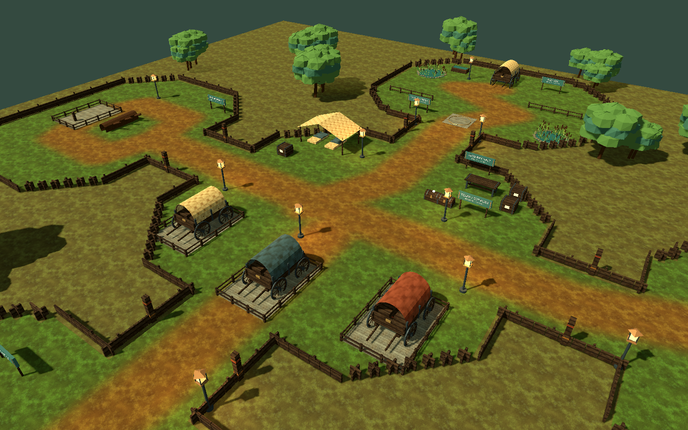
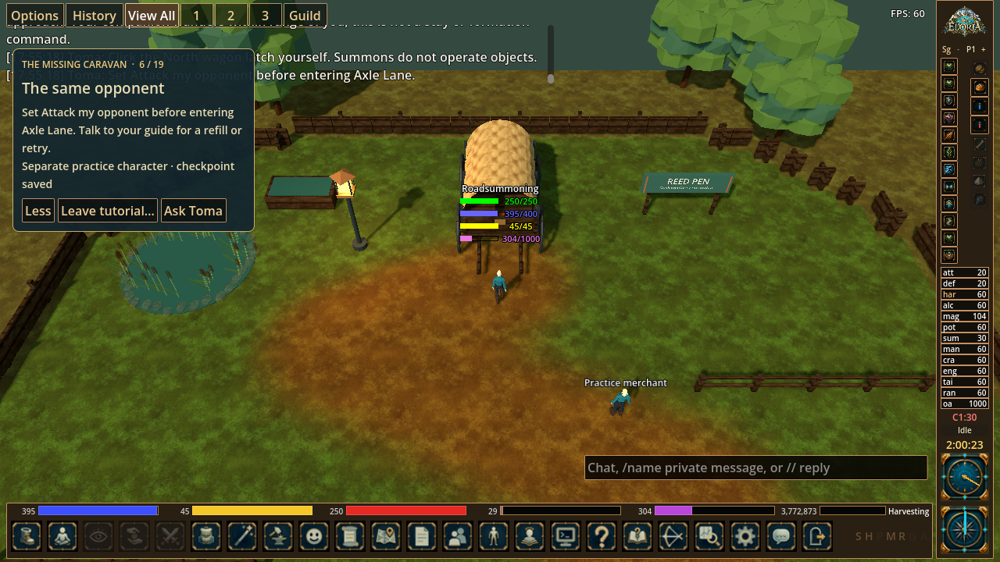

# Reedway Halt environment polish

The Missing Caravan now has a dedicated woodland caravan camp in the native client. This is the second environment pass after Cinderbank; Echo Court, Wayfarer Bastion, Lantern Exchange and Waystone Yard still use the first-pass kit.

## Play

Run the updated client and `dev-server`, then choose **Help → Practice adventures → The Missing Caravan**, or enter `#tutorial summoning`. The 19 main objectives and three optional exercises remain playable through ordinary gameplay controls. Existing progress resumes.

## A caravan worth bringing home

- An empty central hitching yard establishes the missing wagons. Toma's supply camp has a canvas refuge, bedrolls, crates, workbench and warm lamps.
- The North reed pen provides a calling circle, a clear walking lane, shallow reed pools and Mara's waiting wagon. The guide now directs the player to the circle before summoning, leaving time to observe the companion before normal decay.
- Axle Lane keeps its encounter clear of the wagon. The South yard separates creature and summon practice bays with a low divider and a broad passage. West Road offers two usable routes around a fallen trunk.
- Spoked wheels, axles, springs, bowed canvas covers, ropes, planked beds, cargo and latches replace the earlier wagon blocks. Textured meadow tracks, low fences, wooded edges and restrained canvas colors distinguish this map from the workshop.
- Gate leaves are timber rails. Large props reserve matching client/server footprints; closed hitching rails explain why an empty wagon berth remains impassable.

| Saved gameplay result | Visible change |
| --- | --- |
| Open the North latch yourself | The wagon lamp lights; Mara returns to Toma's refuge |
| Clear Axle Lane and open the East latch | The first wagon appears in its home berth; its field model disappears |
| Clear the South encounter and use its latch with Do not attack selected | The blue wagon returns to the middle berth |
| Recover and install the Wood Plank at the West latch | The repaired red wagon returns to the final berth |

These are saved before/after scenes, not a wagon-driving or hauling mechanic. Presentation is derived from completed server objectives. Optional exercises start with the restored caravan. Leave/resume and cached map reloads retain the appropriate state.

## Mechanics and markers

Summons use the existing wandering leash, not formation orders or player-controlled waypoints. The lesson now says this explicitly. Its completion check requires the owner at the North wagon approach and a living owned companion inside the pen and within its normal leash distance. The course keeps the middle lane clear of obstacles that could trap the ordinary summon movement logic.

The calling circle is **60,90**, the North arrival marker is **60,104**, and its latch is **60,107**, approached from **60,105**. East, South and West latch markers now sit on the actual front latch posts, with reachable approaches outside the reserved wagon berths. The map manifest, server interactions, collision grids and native pick volumes are generated from one layout. Unused ore, coal, gauntlet gates, reward cache and waystone props are removed.

Older checkpoints inside a newly authored prop or a closed court move to the refuge without resetting the lesson or inventory. The shared NPC marker follows Mara's current position after the rescue.

## Native review

The overview below uses the production WorldLoader with completed presentation flags applied by the art harness. The gameplay image comes from an actual native TCP session completing the North rescue.

## Verification and remaining work

- `dev-server/tests/test_roads.py`: **40 passed**, including all six core routes, their optional exercises, saved wagon outcomes, resume after the first wagon, and legacy-position recovery for both polished maps.
- `tests/test_reedway_map.py`: **3 passed**. Checks include client/server coordinates and collision parity, reachable open approaches, closed gates, a short companion-sized North route, both West bypasses and clear encounter positions.
- `tests/test_cinderbank_map.py`: **3 passed**, retaining the workshop coordinate and footprint checks.
- Native protocol: **56 checks passed**, including validation of the four optional caravan outcome flags.
- `rendered_reedway.gd`: **9 captures, zero failures**, checking stranded/home model visibility and cached reloads.
- Real TCP native summoning smoke: Summoning window, supply withdrawal, real recipe, behavior picker, walking with a summon, native latch picking, next objective, leave and resume.

Automated server routes control timers and successful mix rolls; the TCP smoke uses accelerated player walking. A novice playtest at normal movement speed is still needed for pacing and comprehension. Bespoke character art, richer ambience and further narrative staging remain future quality work.

## Source and provenance

Rebuild with `python tools/build_followup_maps.py --adventure summoning` from `eloria-client`. Full six-map regeneration also selects the Reedway generator.

`tools/build_reedway.py` authors the environment, footprints and markers. Its small-prop helpers reuse `build_cinderbank.py`; bitmap materials reuse the existing Sunmane Steppe texture set. No externally sourced art was added. The map has **89 batched meshes**, **66 recorded footprints** and **4,434 walkable tiles**.

`road_content.py` derives saved outcome flags and uses the authored encounter positions. `road_scene.gd` and the shared presentation helper in `cinderbank_scene.gd` apply them to the imported meshes and lights without altering the cached source geometry.
