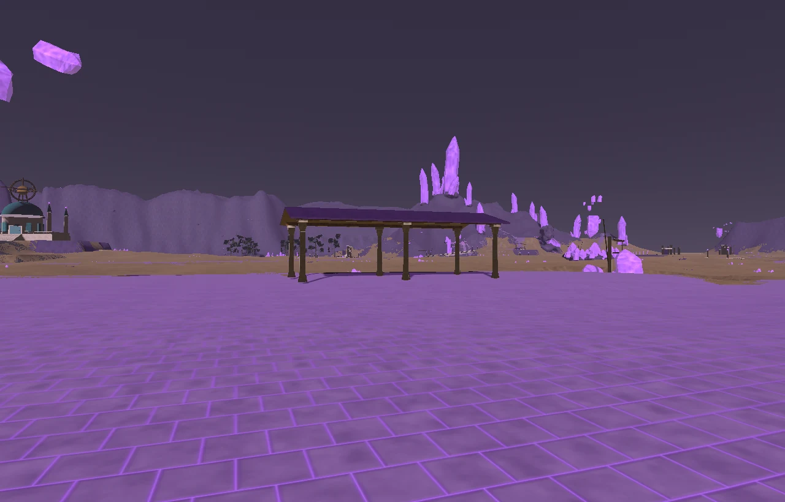
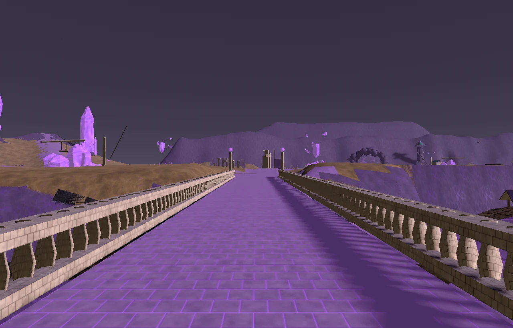
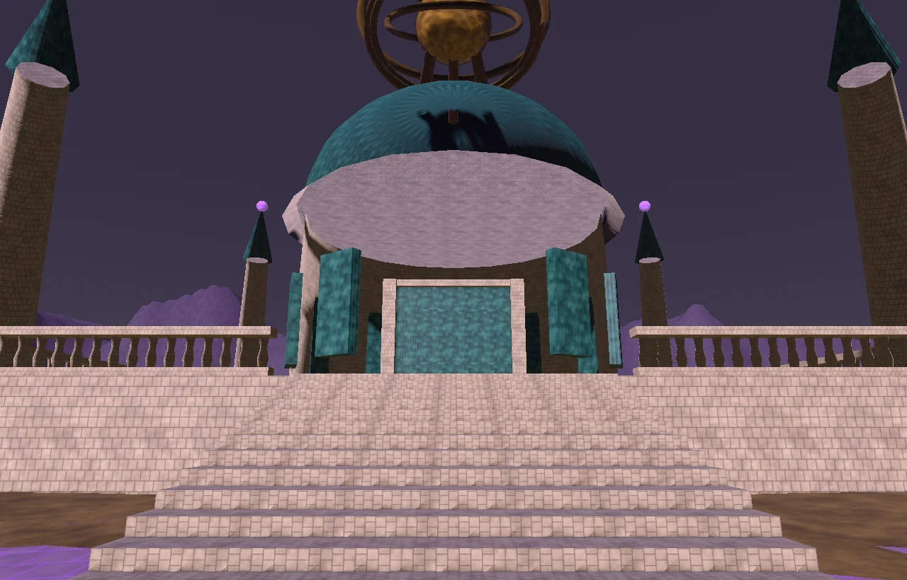
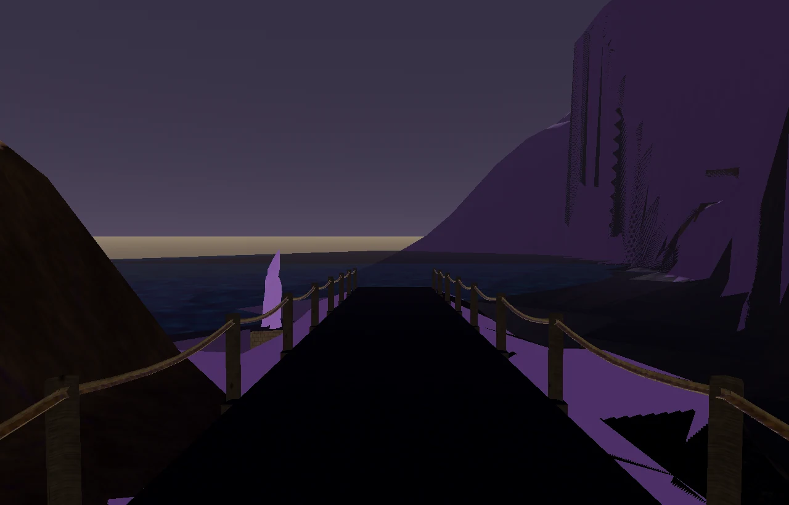

# Amethyst Barrens layout review — 2026-09-07

The arrival now serves a Glasswarden survey district. The existing violet
crystal, ochre dust, pale masonry, purple cloth and verdigris preserve the
region's palette; shared timber supplies the packet jetty and boat. The massif
remains the distant navigation landmark and the observatory the built landmark.
All geometry and textures remain procedural, with no new surface classes.

## Settlement and routes

The Glasswarden Assay Exchange lies just north of arrival, with information
at (-4,-8), storage at (7,-22), crafting at (15,-22) and training at (16,-9),
in world X/Z metres. A low purple canopy shelters the exchange, and the cook's
field station stands across the yard. Runtime services and residents come from
the server registry; the package captures show their reserved standing space.

Seven crystal bridges now carry the actual river and gully crossings. Each
uses a frozen survey of both banks, one continuous sloping deck, masonry
arches, rails outside the cart width and crystal end lanterns. Roads bend
around work sites rather than passing through tents, cranes and central
specimens. Short branches lead to the northern camp, overlooks and old ruins.

The Mirrorhold departure stands beside its tower rather than inside it.
The Crownwater packet uses the southeast cove, with a cargo station on dry
ground and a 25.5 m sloping jetty from (333,99) to (350,118). The existing
east-shore id and continent connection are retained.

The observatory's stair rises toward its podium through an opening in the
front balustrade. The Resonant Vault door is framed into the lower drum at
(-78,-196.2); its return point is on the podium. Four walking strips surround
the closed drum. The smaller collider represents that drum, so the builder
does not push the return point into the stair. Podium and decorative seating
faces no longer duplicate the floor plane.

The river previously rendered below its bed. The shared incision pass cuts a
continuous downstream bed before road construction; the water is above that
frozen bed. The western tributary now joins the main river. The distant
backdrop clips out of the playable terrain and opens east toward the sea.

## Content geography

All fourteen residents retain their names, roles and dialogue. They work at
the exchange, field stations, observatory, diggings, ruins and freight landing.
Easier wildlife occupies worked southern and western ground. Hounds, scorpions
and kobolds occupy the middle workings; the massif and northern ruins hold
the stronger creatures. Shore crabs occupy usable coastal ground. Levels and
rewards were not retuned.

All 51 creature spawns are retained with identical counts per species. All 14
NPCs, 50 harvest nodes, 51 creature spawns and 21 interactive objects are
reachable. Rerunning the content writer reproduces its five files unchanged.
Other regions' NPC, spawn, resource, interactive and special-area records
were compared against the starting files and are unchanged.

## Measurements and validation

| Check | Before | After |
| --- | ---: | ---: |
| Native ground reachable from arrival | 1,032,698 / 1,052,434 (98.12%) | 989,528 / 1,003,974 (98.56%) |
| Reachable native departures and doors | 7 / 11 | 11 / 11 |
| Reachable server departures and doors | 11 / 11 | 11 / 11 |
| Server cells reachable from arrival | 255,340 | 243,450 |
| Complete surveyed server crossings | seven short legacy stubs | 8 / 8, including jetty |
| Detected near-coplanar overlap | 285.4 m² | 36.2 m² |
| Full package GLB | 27.32 MB | 25.87 MB |
| Full package instanced triangles | 652,982 | 604,342 |
| Reduced package GLB | 18.32 MB | 17.06 MB |
| Reduced package instanced triangles | 471,712 | 436,664 |

The walkable area shrinks because the river now occupies a continuous channel.
The crossing network and all authored destinations remain connected. These
reachability counts use the corrected shipped grid, not raw build counters.

Independent vertical probes at 3,065 positions across the eight decks found
no walking-surface holes and at least 0.20 m separation from ground wherever
both surfaces were present. Both exterior GLBs validate with zero errors and
warnings. Runtime verification sampled 331,776 server positions with zero
grounding misses and zero errors.

The full server suite passes 1,519 tests and 351 subtests. The full client
suite reports 128 passes, 93 existing actor/rig/equipment failures and 8,892
passing subtests. After the final podium correction, all twelve route and
walk-surface checks pass. Regressions cover the open podium and stair, the
closed drum, downstream channel incision, and the served departures.

The full GLB, reduced GLB, manifest, collision grid and minimap reproduce byte
for byte after a fresh build and the three correction passes.

## Visual review and remaining work

Thirty-five offline views and thirty-five Godot GL Compatibility views share
the camera index. Godot uses --environment=manifest. Review includes the
exchange, new bridges, jetty, observatory stair and door, massif camp and aerial
composition. The region lighting hook and manifest sun direction are corrected.

Runtime retains one warning for ten large adjacent height differences at the
eastern boundary. About 1.44% of native walkable ground remains outside the
arrival component, with no authored destination or content stranded.

The overlap screen retains scenery candidates at the remote backdrop seam,
water margins, old digging stairs and observatory trim. It also flags some
sloping bridge/terrain pairs because its normal buckets compare absolute plane
offsets for slightly different normals; direct probes show their 20 cm gap.
The measured report is retained rather than described as zero overlap.

The old terrain textures remain visibly repetitive, and the rugged coastal
rim and distant cliffs still look coarse at player height. This pass establishes
settlement purpose, circulation and usable approaches; it does not reproduce
the concept painting's full density of architecture and weather effects.

## Rebuild

Pin every process to the same four logical cores, affinity mask 15, and cap
OpenMP and numerical-library threads at four. From source, run build_amethyst.py
(the region's builder name), build_interiors.py and export_insides_collision.py.
Then run refine_walk_heights.py, open_walk_surfaces.py and
stamp_solid_landmarks.py for amethyst_barrens, in that order, followed by
secrets_build.py.

Sync authored collision for amethyst_barrens, resonant_vault and
amethyst_barrens_secrets. Generate maps, apply the scoped continent portals,
author scoped content and run relocation for those maps. Complete a global
portal dry run as a final graph check.

Complete capture_views.py before godot_capture.gd reads its index. Render with
the manifest environment, compress the captures, build the comparison sheets
and compress those. Historical client-captures retain the earlier layout;
godot-captures contains this pass.

## Publication check — 2026-09-07

Rebased onto develop's accepted-creature update before publication. The combined
server suite passes 1,519 tests and 351 subtests. The combined client suite has
128 passes and 95 failures: the previous 93 plus two Thunder Ram structural/rig
subtest failures introduced by that update. The Thunder Ram GLB, catalogue and
asset tests match upstream exactly; the map commit does not modify them.
