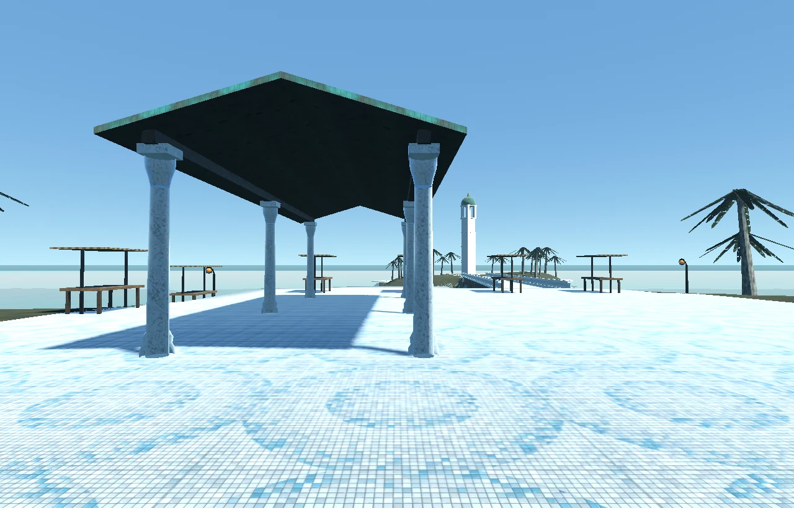
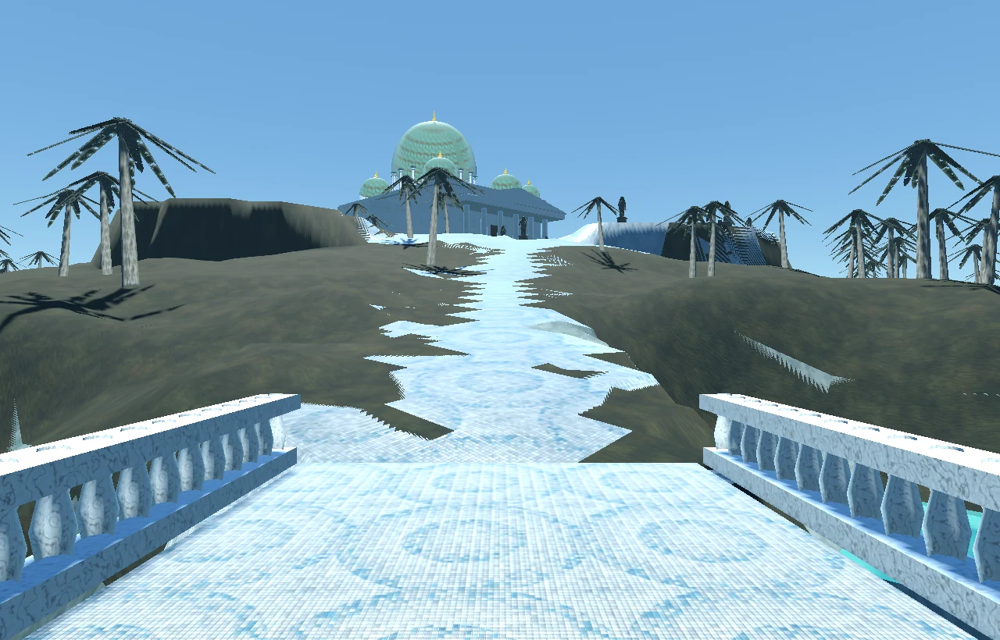
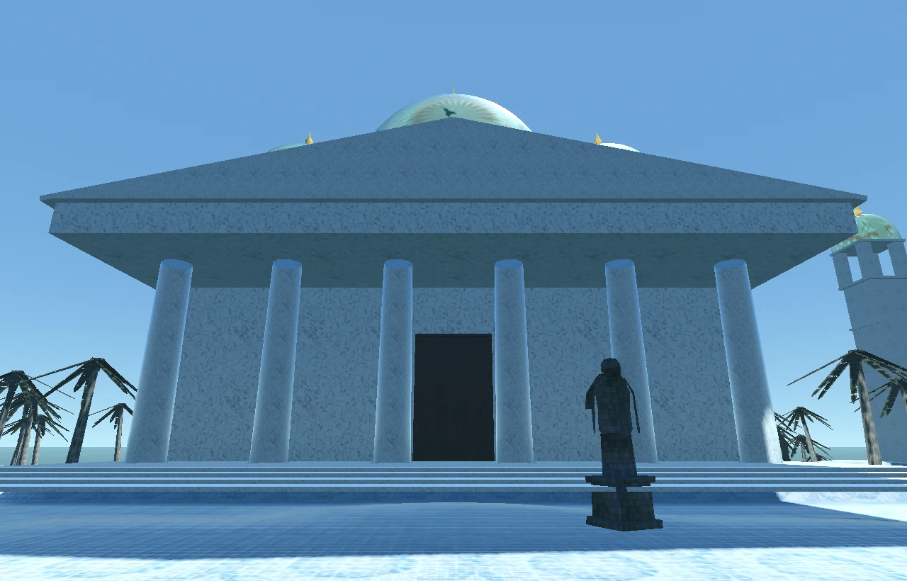

# Crownwater layout review — 2026-09-07

The arrival now reads as a working harbour serving a monumental lagoon city.
The pale marble, teal copper, mosaic paving and existing palms preserve the
region's established palette. New pieces are procedural shared recipes in
`_toolkit/amberwood/civiccraft.py`; no imported models or bitmap assets were added.

## Settlement and routes

The service court lies west of the arrival: information at (-5,-2), storage
at (-10,9), field crafting at (-20,9), and training at (-20,-4), in world X/Z
metres. The bank and workbench share a lined copper shelter. The client draws
these service objects from the server registry; the geometry-only captures
show their reserved court and shelter without duplicating the objects.

The customs warehouse stands east of the court at (23,8), facing the court
across a five-metre cargo ramp. Stalls form an open market edge rather than a
random ring. Fourteen existing named NPCs have authored work posts, preserving
their roles and dialogue. Maelis and Daro are at the arrival, the customs officer
is beside the ramp, and the sexton and ringer stand outside their own buildings.

The basilica faces south toward the compass plaza. Its six-column portico
leaves the central doorway open, and its four treads reach the podium exactly.
The Drowned Crown uses a covered side entrance at (139,-109), the campanile
threshold is at (162,-146), and the customs trigger stands on its cargo ramp
at (10,8). The other four pavilion entrances retain their existing open courts.

All 24 causeways retain stone arches and balustrades, but now meet surveyed
shore points at their exact lengths and elevations. Shore surveys are frozen
before grading, stored on each terrain instance, and reused by both geometry
and collision metadata. The lower masonry ends below a single deck skin;
a shallow rebate beneath landward deck ends prevents coplanar ground.
Paved paths join the bridgeheads across the inner islands and climb from the
arrival spoke toward the basilica. Ferry waystations occupy dry island courts.

## Content geography

The harbour is safe service ground. Inner western gardens and southern shores
offer Reed, Watercress and easier animals. Kelp and Shell belong to the working
inner shores; Pearl and Salt draw a player onto the outer branches. Serpents,
constructs, colossi and temple guards occupy the exposed outer isles, with
four metres of clearance reserved along the through routes. Geography supplies
the progression; creature levels and rewards were not retuned.

All 46 exterior creature spawns were retained, including the newer species
missing from the older writer catalogue. Explicit habitats relocate those
additions; additions without a habitat retain their records. NPC posts resolve
before habitat placement, so rerunning the writer does not shift content around
its own previous output. Five authored output files reproduce unchanged. All 14 NPCs, 46 exterior
spawns and 44 harvest nodes are reachable on the served grid.

## Measurements and validation

| Check | Before | After |
| --- | ---: | ---: |
| Native ground reachable from arrival | 125,590 / 337,376 (37.2%) | 331,623 / 334,221 (99.2%) |
| Reachable native departure/door positions | 0 / 14 | 14 / 14 |
| Server cells reachable from arrival | 78,192 | 80,769 |
| Complete surveyed server crossings | not declared | 24 / 24 |
| Detected near-coplanar overlap | 770.8 m² | 114.3 m² |
| Full package GLB | 38.56 MB | 33.47 MB |
| Full package instanced triangles | 1,263,372 | 931,510 |
| Reduced package GLB | 25.75 MB | 20.66 MB |
| Reduced package instanced triangles | 1,099,750 | 767,978 |

The starting native reach was measured from the actual checked-out collision
grid, not inferred from the historical 95.5% note. The legacy server grid could
reach the ferry tiles while the native grid could not; the surveyed corrected
fold now supplies the same authored route network.

Both exterior GLBs validate with zero errors and zero warnings. Runtime
verification sampled all 331,776 server positions with zero grounding misses
and zero errors. The full package, reduced package, manifest, collision grid
and minimap reproduce byte for byte after the documented correction sequence.
The global continent portal writer completes its dry run, including the
basilica and customs entrances that previously blocked it.

The full server suite passes 1,517 tests and 351 subtests. The client Python
suite reports 125 passes, 93 existing actor/rig/equipment failures and 8,892
passing subtests; the failure count has not grown. Geometry and content
regressions cover exact non-rounded deck elevations, one upward walking skin,
scoped NPC rewrites, preservation of newer creature records and all Crownwater
departures from the default arrival.

## Visual review and remaining work

Twenty-eight offline frames and twenty-eight Godot GL Compatibility frames use
the package camera table. Godot was invoked with `--environment=manifest`.
The review checked the service shelter from below, cargo ramp, undercroft,
basilica door and bridge landing at player height, plus the aerial composition.
The corrected material-registration hook and exact triangle sampling for deck
cameras replace the stale captures and bounding-box camera heights.

The remaining overlap report concerns older decorative inlays, the remote reef
water plane, existing building details and a small quay/parapet intersection.
One old harbour apron still approaches the terrain within the overlap tolerance;
none of the new causeway walking skins share the terrain plane. These are
recorded for a later scenery pass rather than described as a zero-overlap map.

Runtime retains 605 large height differences at shore cliffs and beneath
bridges, plus 11 sampled quay-edge cells whose encoded height misses the
rendered apron. None are an authored departure or surveyed crossing endpoint.
The remaining 0.8% of native walkable cells is outside the connected route
network. The old repeated pavilion architecture and sparse palm shapes remain
visible; this pass establishes circulation and settlement purpose rather than
claiming to reproduce all the concept painting's architectural density.

## Rebuild

Use the Python 3.13 interpreter and pin every process to the same four logical
cores (affinity mask 15); OpenMP and numerical-library threads are capped at 4.

From `crownwater/source`, build `build_crownwater.py`, `build_insides.py`, and
`export_insides_collision.py`. From `nymara-regions`, run
`_toolkit/refine_walk_heights.py crownwater`,
`_toolkit/open_walk_surfaces.py crownwater`,
`_toolkit/stamp_solid_landmarks.py crownwater`, in exactly that order after a
fresh raw build, then `_toolkit/secrets_build.py crownwater`.

Sync authored collision for `crownwater`, `drowned_crown` and
`crownwater_secrets` separately. Generate the served maps, apply
`continent_portals.py --region crownwater`, then
`author_region_content.py all --region crownwater`. Apply the relocation pass
to Crownwater and its interior layers. The first pass moved six gauntlet return
records by two tiles and one territory control point by two tiles; the final
repeat required no further moves. Other regions' NPCs, resources and spawns
remain unchanged.

Recreate the captures with `_toolkit/capture_views.py`, then
`godot_capture.gd --environment=manifest`. Compress captures, build the shared
comparison board with `_toolkit/make_comparison.py`, and compress the boards.
`source/make_sheets.py` refreshes the legacy all-captures sheet from the
Godot capture directory; run it before the shared comparison tool.
