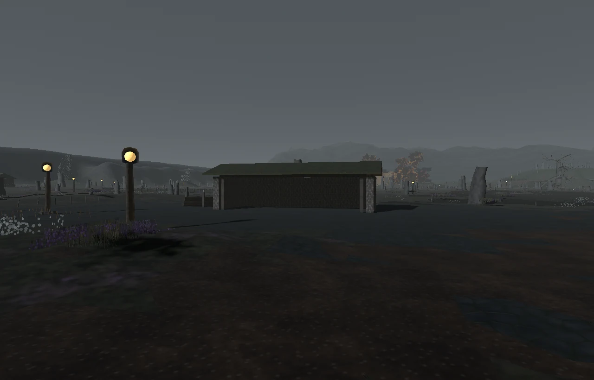
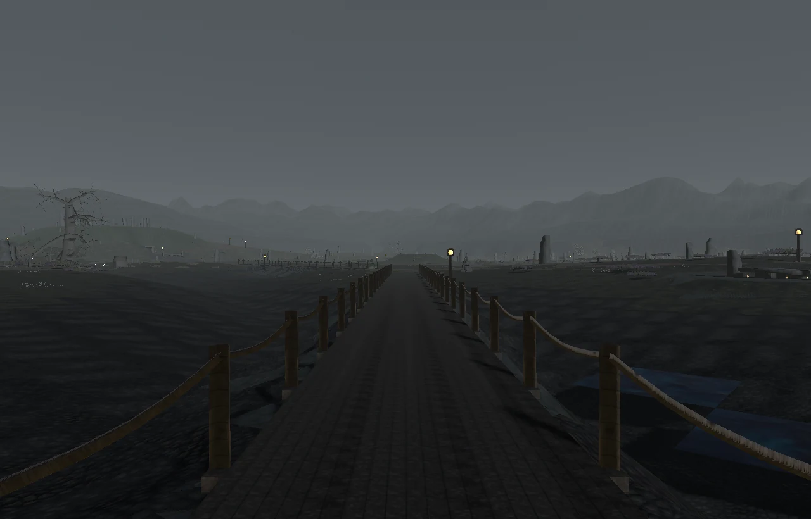
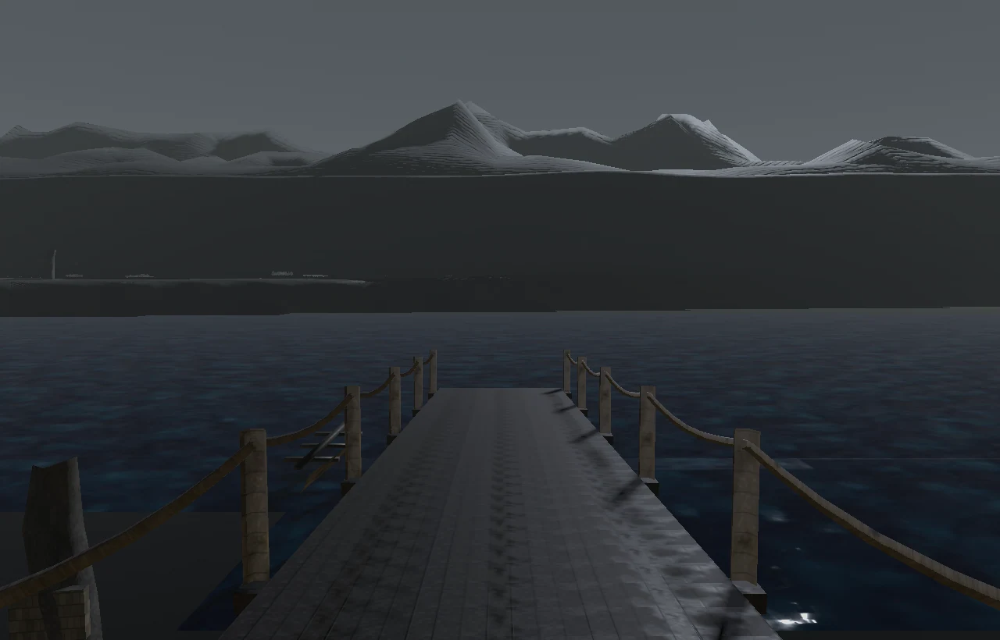
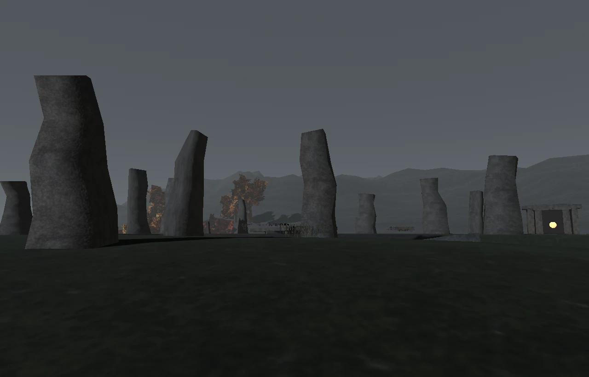

# Grey Moors layout review — 2026-09-07

The moor now has a working western edge, a sheltered arrival and a deliberate
route to the northern burials. Wet peat, drystone, turf roofs, dead trees and
sparse warm lamps retain the concept's dark overcast palette. All new geometry
uses shared procedural recipes; no imported models, textures or surface classes
were added.

## Settlement and routes

The Peat Road Refuge stands on dry ground before the first wet crossing.
Information is at (-7,3), storage at (-20,-10), crafting at (-12,-10) and training
at (-25,4), in world X/Z metres. A low turf roof shelters the storage and work
posts; wind walls, fuel and a pony holding pen give this a reason to be here.
The client draws service objects from the server registry, so these package
captures show their reserved court without the runtime objects.

The western road connects Westhaven to the refuge through the peat workings.
Eight timber walks and three stone bridges now cross the wet sections of their
actual routes. Their lengths and elevations come from the same frozen bank
survey used for geometry and collision metadata. Continuous plank tops share
their edges and leave the rope rails outside the walking width. Shallow rebates
separate land and deck at the banks; grading opens the approaches and scattered
dressing is cleared from the route.

The Great Barrow's raised stone crown supplies the northern silhouette. Its
entrance faces the southern approach, with a separate winding ascent around the
mound's shoulder. Reducing the entrance court avoided a hard shelf through the
mound. The older Breached Barrow lore set now occupies its own nearby site,
instead of overlapping the main doorway.

The coastal shrine and beacon occupy dry ground above the southwest cove.
A seventeen-metre jetty descends to a boat at the ferry landing; the Crownwater
ferry retains its stable east-waygate id despite moving from an inland ridge
to the actual shore. The continent graph is unchanged.

## Content geography

All fourteen named residents keep their roles and dialogue, with posts at the
refuge, peat works, crofts and burial entrances. Existing creature counts and
harvest vocabulary are preserved. Ponies, moths and easier wildlife occupy
worked western and southern ground; hounds and goblins occupy the middle bogs;
knights, constructs and other dangerous inhabitants occupy northern burials.
The authored habitats keep through roads clear. This establishes a geographic
progression without retuning creature levels or rewards.

All 14 NPCs, 56 creature spawns and 65 harvest nodes are reachable on the served
grid. Rerunning the content writer reproduces all five content files unchanged.
Records for other regions were compared before and after and remain unchanged.

## Measurements and validation

| Check | Before | After |
| --- | ---: | ---: |
| Native ground reachable from arrival | 1,144,436 / 1,149,659 (99.55%) | 1,149,094 / 1,151,273 (99.81%) |
| Reachable native and server departure/door positions | 11 / 11 | 11 / 11 |
| Server cells reachable from arrival | 284,100 | 284,407 |
| Complete surveyed server crossings | legacy short stubs | 12 / 12, including jetty |
| Detected near-coplanar overlap | 211.0 m² | 37.1 m² |
| Full package GLB | 30.97 MB | 31.09 MB |
| Full package instanced triangles | 761,194 | 757,336 |
| Reduced package GLB | 16.84 MB | 17.19 MB |
| Reduced package instanced triangles | 408,016 | 417,746 |

Reachability uses the corrected shipped collision grid, not the raw build's
performance counters. A separate surface probe sampled 6,030 positions across
the twelve decks, found no walking-surface holes and measured at least 0.18 m
between the deck and ground wherever both surfaces were present.

Both exterior GLBs validate with zero errors and zero warnings. Runtime
verification sampled all 331,776 server positions with zero grounding misses
and zero errors. The full GLB, reduced GLB, manifest, collision grid and minimap
reproduce byte for byte after a fresh build and all correction passes.

The full server suite passes 1,518 tests and 351 subtests. The full client
Python suite reports 126 passes, 93 existing actor/rig/equipment failures and
8,892 passing subtests; the failure count has not grown. The shared route tests
now cover ray hits at plank seams, and the served-map checks cover every Grey
Moors departure and interior entrance from the default arrival.

## Visual review and remaining work

Thirty-two offline frames and thirty-two Godot GL Compatibility frames use the
same camera index. Godot uses --environment=manifest. Player-height review
checked the refuge, plank seams, stone bridge approaches, ferry landing,
barrow doorway and crown. The manifest sun direction was corrected to light
from above, and the offline views now use the region's own overcast lighting.
The distant backdrop clips out of the playable ground.

The overlap screen still reports older scenery candidates in crofts, ground
cards, peat works and distant seams. It also reports some sloping deck/ground
pairs even though direct surface probes show 18 cm separation: its normal
buckets compare absolute plane offsets for slightly different normals. These
screening results are retained; this is not a claim of zero overlap everywhere.

Runtime retains one warning for 196 large adjacent height differences at
cliffs and beneath elevated geometry. About 0.19% of native walkable ground
remains outside the arrival component. All authored destinations and content
are connected. The distant boundary cliffs remain visibly coarse, and older
croft details and terrain tiling would benefit from a later asset pass.

## Rebuild

Pin all processes to the same four logical cores (affinity mask 15), with
OpenMP and numerical-library thread limits of four.

From grey_moors/source, run build_grey_moors.py, build_interiors.py and
export_insides_collision.py. From nymara-regions, run
_toolkit/refine_walk_heights.py grey_moors,
_toolkit/open_walk_surfaces.py grey_moors and
_toolkit/stamp_solid_landmarks.py grey_moors, in that order, followed by
_toolkit/secrets_build.py grey_moors.

Sync authored collision for grey_moors, grey_moor_barrows and grey_moors_secrets.
Generate served maps, apply continent portals for Grey Moors, author its
content, then relocate its exterior and interior content. The global portal
writer also completes its read-only validation.

Run capture_views.py to completion before godot_capture.gd: the Godot harness
reads the offline capture index, not views.py directly. Use the manifest
environment, compress both capture sets, build the shared comparison sheets,
then compress the sheets. Historical client-captures retain the earlier pass;
godot-captures and the current comparison sheets contain this layout.

## Publication check — 2026-09-07

Rebased onto develop's accepted-creature update before publication. The combined
server suite passes 1,519 tests and 351 subtests. The combined client suite has
128 passes and 95 failures: the previous 93 plus two Thunder Ram structural/rig
subtest failures introduced by that update. The Thunder Ram GLB, catalogue and
asset tests match upstream exactly; the map commit does not modify them.
