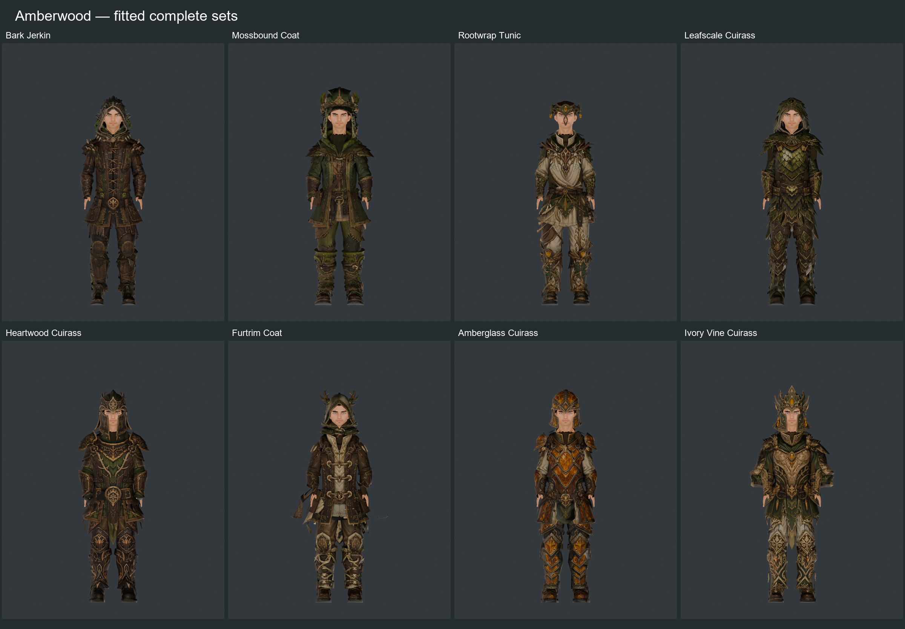
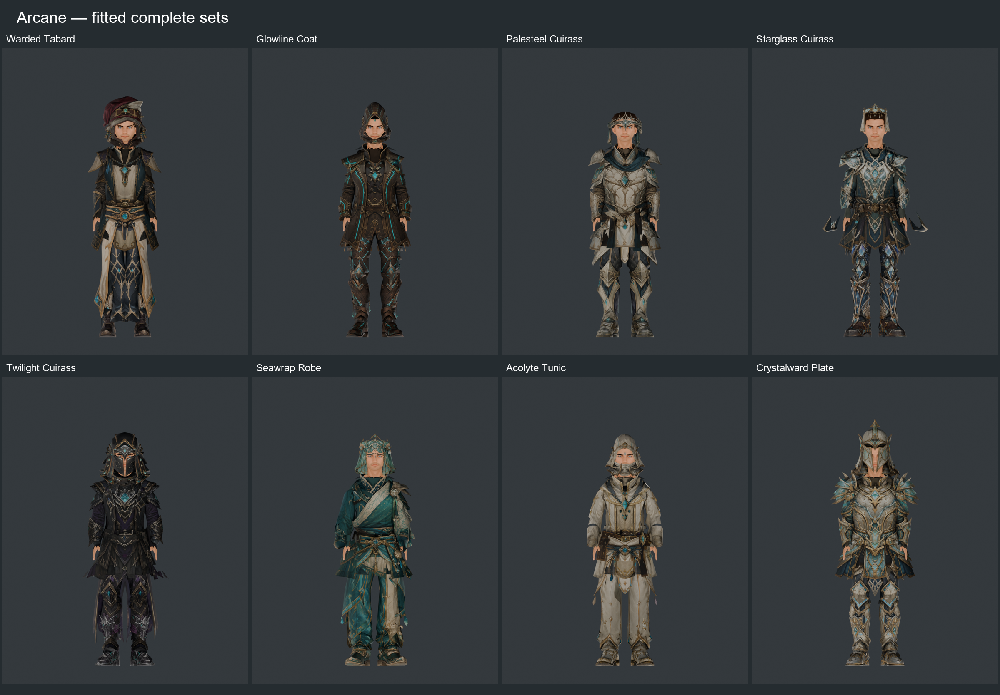
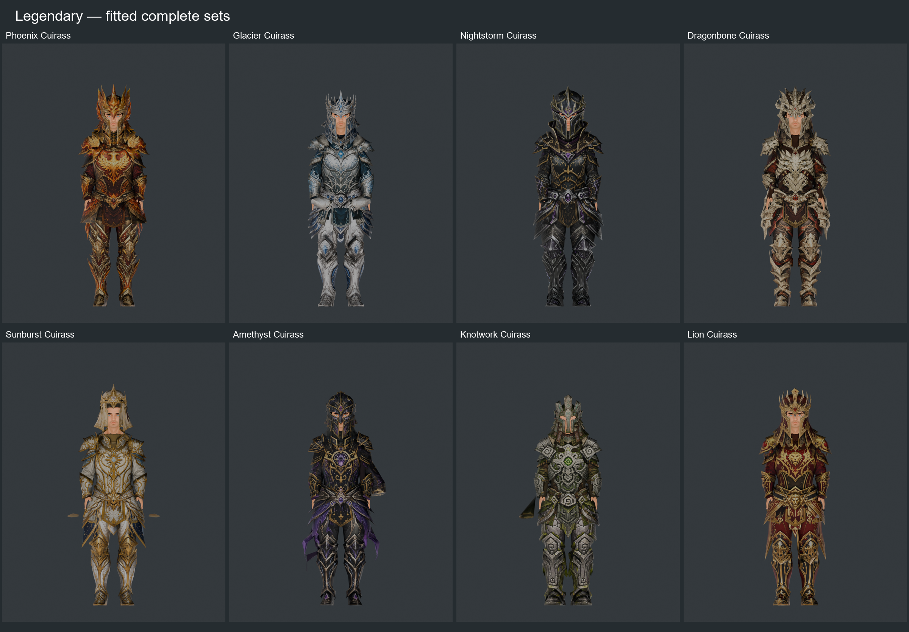
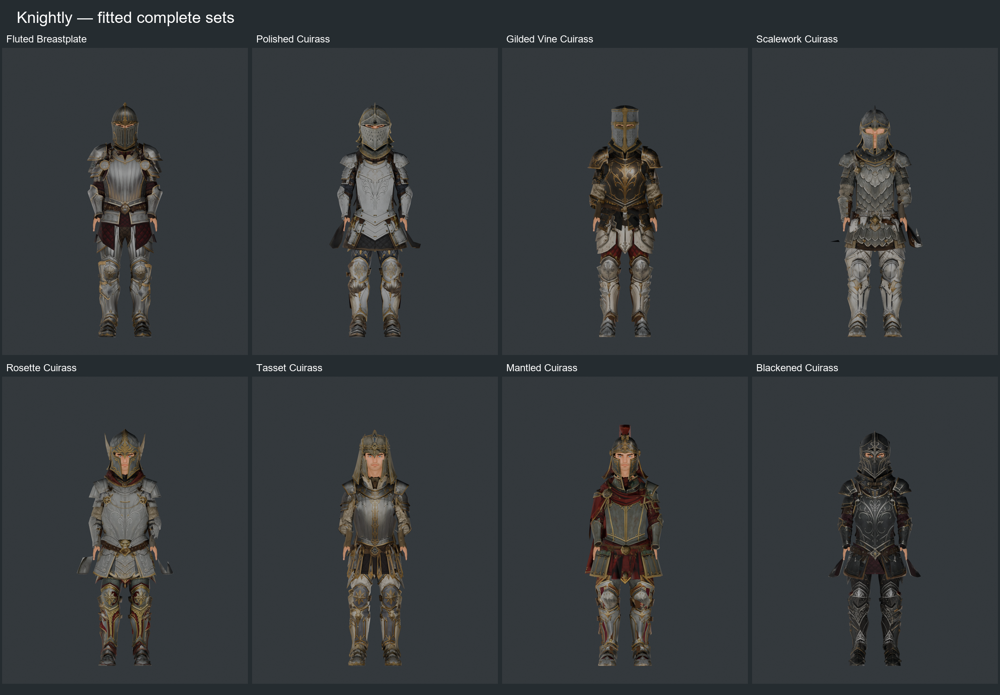
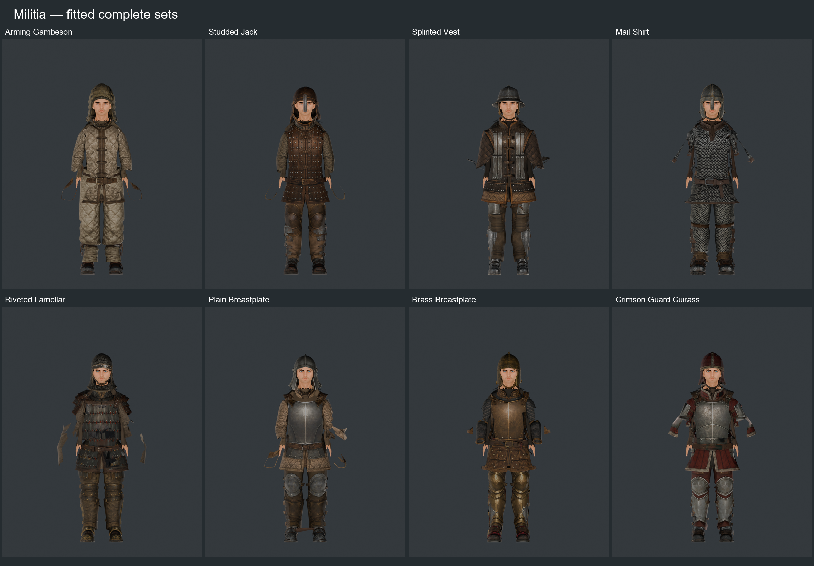
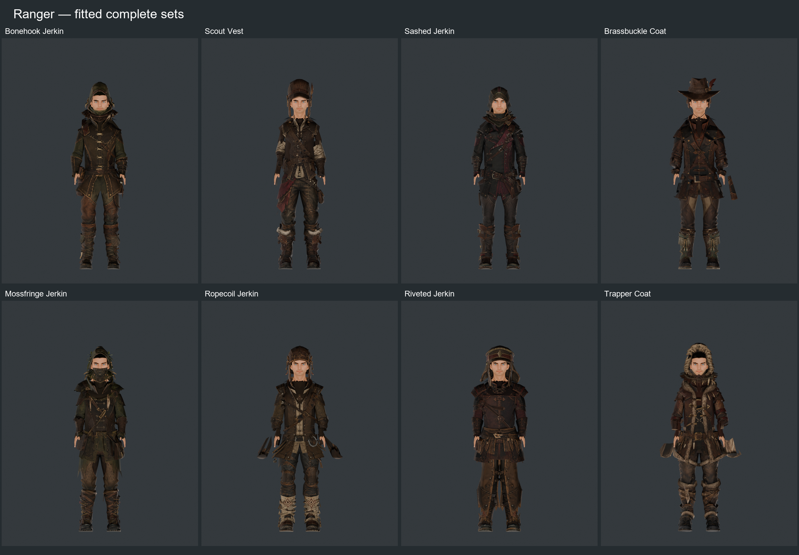
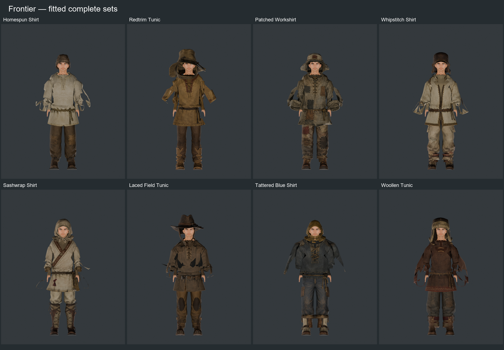
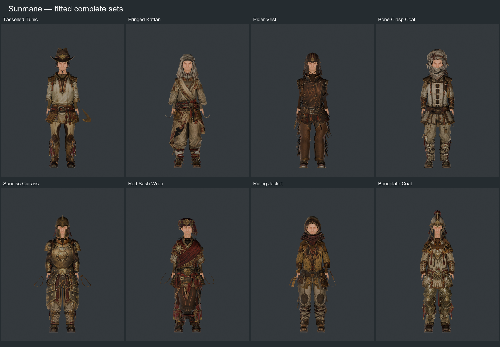
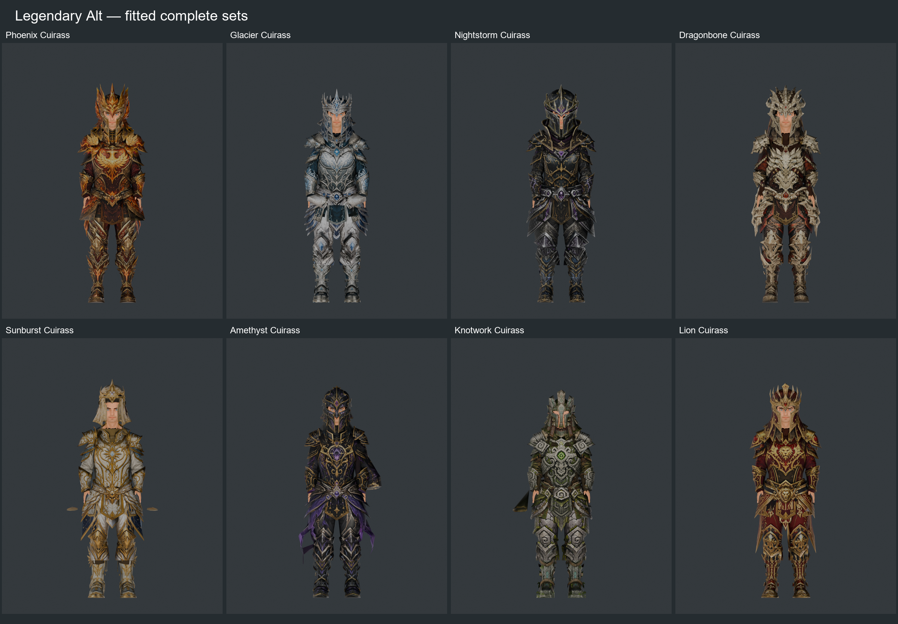

# Complete generated armour comparisons

The fitting report is [here](../generated-limb-head-remap.md). The full local gallery has all 72 paired PNGs and packed Blender scenes at `qa/limb-head-remap/sets/index.html`.

## Families

### Amberwood

### Arcane

### Legendary

### Knightly

### Militia

### Ranger

### Frontier

### Sunmane

### Legendary Alt

## Detailed complete sets

| Outfit | Armour alone | Worn | Side | Bent |
| --- | --- | --- | --- | --- |
| legendary_01 | [Assembled](assembled-legendary_01.png) | [Worn](worn-legendary_01.png) | [Side](side-legendary_01.png) | [Bent](bent-legendary_01.png) |
| amberwood_04 | [Assembled](assembled-amberwood_04.png) | [Worn](worn-amberwood_04.png) | [Side](side-amberwood_04.png) | [Bent](bent-amberwood_04.png) |
| ranger_05 | [Assembled](assembled-ranger_05.png) | [Worn](worn-ranger_05.png) | [Side](side-ranger_05.png) | [Bent](bent-ranger_05.png) |
| arcane_03 | [Assembled](assembled-arcane_03.png) | [Worn](worn-arcane_03.png) | [Side](side-arcane_03.png) | [Bent](bent-arcane_03.png) |

## Individual source comparisons

Fitted on the left, original source on the right, normalized to equal height. The worn sheet retains character scale. The legendary leg source includes the matching feet, which ship separately as sabatons.

| Piece | Original / fitted | Worn |
| --- | --- | --- |
| legendary_leg_armor_01 | [Comparison](legendary_leg_armor_01.png) | [Worn](legendary_leg_armor_01_worn.png) |
| legendary_eloria_boots_01 | [Comparison](legendary_eloria_boots_01.png) | [Worn](legendary_eloria_boots_01_worn.png) |
| legendary_eloria_helm_01 | [Comparison](legendary_eloria_helm_01.png) | [Worn](legendary_eloria_helm_01_worn.png) |
| rugged_ranger_legwear_05 | [Comparison](rugged_ranger_legwear_05.png) | [Worn](rugged_ranger_legwear_05_worn.png) |
| leather_adventurer_boots_05 | [Comparison](leather_adventurer_boots_05.png) | [Worn](leather_adventurer_boots_05_worn.png) |
| adventurer_headwear_05 | [Comparison](adventurer_headwear_05.png) | [Worn](adventurer_headwear_05_worn.png) |
| amberwood_woodland_legguards_04 | [Comparison](amberwood_woodland_legguards_04.png) | [Worn](amberwood_woodland_legguards_04_worn.png) |
| amberwood_woodland_boots_04 | [Comparison](amberwood_woodland_boots_04.png) | [Worn](amberwood_woodland_boots_04_worn.png) |
| amberwood_forest_helm_04 | [Comparison](amberwood_forest_helm_04.png) | [Worn](amberwood_forest_helm_04_worn.png) |
