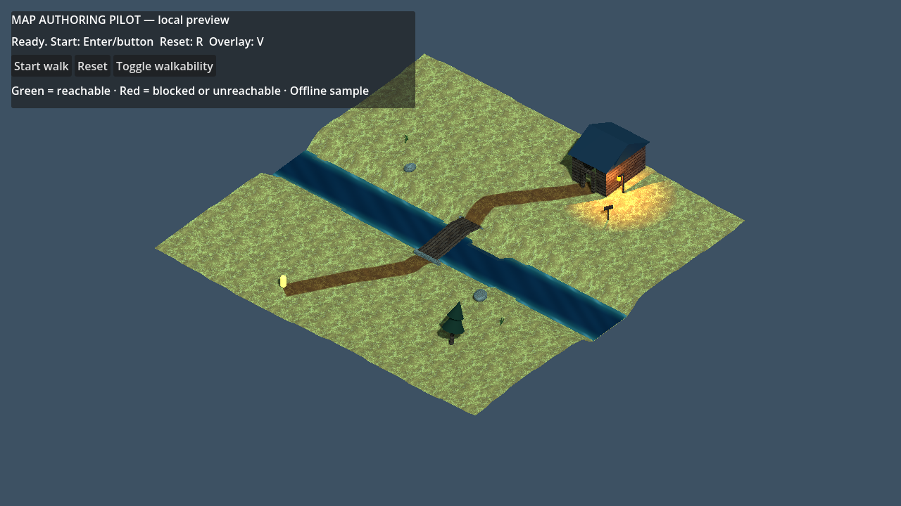
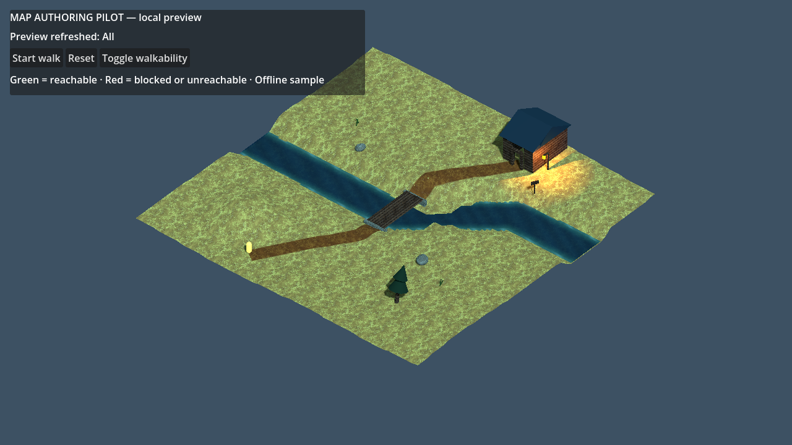

# Map authoring pilot

This is a small, isolated Godot 4.7.2 example for editing a map with immediate viewport feedback. It does not alter the production startup scene, load the continent pipeline, connect to a multiplayer server, or publish map data.



The edited-control example below bends `River` east and raises `WestHeight`; both changes exist only in the capture's in-memory scene.



## Open it

From `godot-client`, run:

```powershell
& 'C:/Users/User/Desktop/eloria-project/eloria-client/godot-client/Godot_v4.7.2-stable_win64_console.exe' --editor --path . 'res://src/dev/map_authoring_pilot/map_authoring_pilot.tscn'
```

Or double-click `open-map-authoring-pilot.bat` in `godot-client`.

Godot may import project assets on the first launch. Select the `MapAuthoringPilot` root to edit terrain, water level, preview, and export settings in the Inspector. Select the road, river, or an individual bridge to edit its width and other object settings. The root's **Edit road points**, **Edit river points**, and **Edit terrain heights** buttons select the matching saved control and switch the 3D viewport to it. The controls are:

- `AuthoredControls/Ground`: owns the base ground surface for the whole map. Its `Regions` folder contains disabled Soil and Sand starter areas for local ground changes.
- `AuthoredControls/Road`: a `Path3D` whose curve controls the worn path. Set **Default Width** for the whole road, or expand **Point Widths** and enter a full width for individual curve points. A point value of `0` inherits the surrounding taper.
- `AuthoredControls/River`: a `Path3D` whose curve controls the river channel, terrain cut, visible water, and blocked export cells. Its **Default Width** and optional **Point Widths** work the same way as the road.
- `AuthoredControls/TerrainHeights`: a group of `Marker3D` height handles. Move a handle up or down for a smooth radial height offset, and edit its **Influence Radius** in the Inspector. Move it in X/Z, duplicate it, or delete it to change where local shaping applies.
- `AuthoredControls/Bridges`: contains the saved bridges. Select `Bridge` to change its width, arch, water clearance, or deck texture rotation. Move its `Start` and `End` markers to place the bank landings. Duplicate the whole bridge with Ctrl+D for another crossing, then move the copy and its endpoints; delete the whole bridge node to remove that crossing.
- `Building`: move or rotate the open-front cabin and its attached entrance, or edit its separate wall and roof surfaces.
- `Building/Entrance` and `Spawn`: adjust the attached doorway endpoint and route start.
- `AuthoredScenery`: move the saved shore rocks, grass clumps, wind pine, sign, or cabin lantern with the normal transform tools. These cosmetic nodes stay outside `GeneratedPreview`, so regeneration does not erase their placements.
- `AuthoredAssets`: contains props placed from the **Map Assets** dock. These are ordinary saved scene nodes and also stay outside `GeneratedPreview`.

## Place library assets

Open **Map Assets** from the editor docks, search by name, and optionally narrow the category. Select an item, press **Place on terrain**, then click the terrain in the 3D view. A see-through ghost follows the cursor, and placement stays armed for more clicks until you right-click or press Escape. **Add at view center** places at the terrain point under the middle of the 3D view. Use **Refresh** after changing the project asset catalog. The turn, raise and size keys, grid snapping, prefabs and the batch **Map tools** are described in [map-authoring-usability.md](map-authoring-usability.md).

Placed items are selected immediately. Move, rotate, scale, duplicate, delete, undo, and redo them with Godot's normal scene tools, then save the pilot scene. The dock grounds the visible bounds on the actual preview terrain and uses the catalog height for the initial size of world-library models. Items live under `AuthoredAssets`, so refreshing generated terrain, roads, bridges, or buildings does not erase them.

World-library GLBs keep their linked scene identity and original materials, including multi-material models. The starter rocks, pine, grass, sign, and lantern are editable local copies; select one of their mesh parts to use its existing local **Surface** texture controls. Library props are visual in this pilot and do not change walking collision or exported map data.

The **Continent props**, **Continent structures**, and **Continent landmarks** categories contain individual objects extracted from the current continent packages: secret entrances, gates, a bridge, buildings, caves, trees, a skiff, and other reusable forms. They keep their current continent scale and native materials. Large landmarks can be resized with the normal scale gizmo. A boat is grounded like every other visual asset; after placing one, move it up in Y to the water level you want. Whole regions, cities, terrain, and fitted access assemblies are never library entries.

To edit either path, select its `Path3D` node and work in the 3D viewport. In **Select Points** mode, Ctrl+left-click the curve or empty space to add or split a point, and right-click an existing point to delete it. The dedicated **Add Point** mode also splits when you click the curve and appends when you click empty space; **Delete Point** mode removes a clicked point. Ctrl+Z uses Godot's native undo. **Top View** is recommended because road and river authoring is in X/Z; point Y is intentionally ignored. The river's visible water and blocked-cell mask resolve to the pilot's half-metre export samples. These controls follow the Godot 4.5 stable `Path3D` editor behavior verified in [`path_3d_editor_plugin.cpp`](https://github.com/godotengine/godot/blob/4.5-stable/editor/scene/3d/path_3d_editor_plugin.cpp).

Entries in **Point Widths** use the same indices as the curve's points. Adding or deleting curve points with the normal `Path3D` tools adjusts the width entries automatically; a newly inserted `0` keeps the surrounding taper. Undo and redo restore the matching saved widths.

Moving a terrain handle in Y creates a local offset rather than changing the map-wide baseline. **Terrain Base Height** and **Terrain Relief** on `MapAuthoringPilot` remain the global controls. Duplicate or delete handles in the Scene tree, use the normal move tool for Y and X/Z, and press Ctrl+S to save the authored nodes.

## Edit one object's surface

Texture choices live on the object they affect. Select `Ground`, `Road`, `River`, an individual bridge, or `Building`, then expand its **Surface** field in the Inspector. A bridge has separate **Deck Surface** and **Support Surface** fields. The building has separate **Wall Surface** and **Roof Surface** fields. Changing one object leaves every other object unchanged.

For saved scenery, expand `AuthoredScenery` and select the mesh part itself. For example, choose `ShoreRockWest`, `WindPine/Trunk`, `WindPine/LowerNeedles`, `CabinLantern/Glass`, or `WeatheredSign/Board`. Every mesh part has its own **Surface**, including grass, foliage, and glowing glass. Duplicate a bridge or scenery mesh with Ctrl+D to get an independent surface, then choose a different texture or rotation on the copy.

Each surface offers **Custom**, **Grass**, **Worn earth**, **Soil**, **Sand**, **Timber**, **Stone**, **Thatch**, **Textile**, **Canvas**, **Metal**, **Leather**, **Hide**, **Bone**, **Crystal**, **Cavern**, and **Slate**. These choices reuse the Sunmane PBR texture families already licensed for Eloria. A Road surface always keeps its feathered-edge shader while changing the selected texture.

Set **Rotation Degrees** on that local surface to rotate only its texture. The older bridge **Deck Texture Rotation Degrees** field remains additive for saved-scene compatibility; prefer the Deck Surface rotation for new edits. Rotation works with the included presets and supported standard or pilot shader materials. If a Custom shader uses unsupported texture features, the pilot keeps its original material and prints a warning.

Choose **Custom** to assign a material directly. Enable **Show Advanced Materials** on that surface to expose its source material without changing the selected preset. Advanced fields control tint, normal strength, roughness, ORM response, triplanar **UV1 > Scale**, and supported shader parameters. Direct edits remain local to the selected object and survive refresh and save/reopen. Switching away from a texture and back during the editing session recovers that surface's current material, so Inspector undo can restore Custom materials and advanced tweaks.

The terrain and road start at `GROUND_UV_SCALE = 0.24`, and bridge decks start at `TIMBER_UV_SCALE = 0.5`, near the top of `map_authoring_pilot.gd`. Change those constants for code-wide texture density. Triplanar surfaces use their source material's **UV1 Scale**. The old root visual style remains hidden storage used only when opening an older scene that has no local surface.

## Add local ground areas

Expand `AuthoredControls/Ground/Regions` and select `SoilArea` or `SandArea`. Turn on **Enabled**, choose **Texture** and **Texture Rotation** directly on the region, then use Godot's normal move, rotate, and scale tools to place it in X/Z. Set **Shape**, full **Size**, **Blend Width**, **Opacity**, and **Priority** in the Inspector; higher Priority areas overlay lower ones. Expand **Surface** only for Custom and advanced material editing. The Scene-tree eye temporarily hides an enabled patch. Duplicate an area with Ctrl+D to make another independently textured patch, or delete the whole area node to remove it. Height is cosmetic; each patch follows the existing terrain surface and does not change walking or export collision.

Soil and Sand are colour and texture-density variants of the existing licensed ground texture maps; this pilot does not add a separate desert source asset. Up to 127 enabled regions can have distinct draw layers. If more are enabled, the lowest-priority regions, with scene order as the tie-breaker, are kept and the rest are skipped with a warning.

Lighting is saved in the scene rather than generated. Select `Sun` to edit direction, colour, energy, and shadows; select `Environment` and expand its resource to edit the cool ambient/background values. The warm pool is `AuthoredScenery/CabinLantern/WarmLight`, where the Inspector exposes colour, energy, range, and shadows. Select the lantern or another prop's parent node to move the complete authored instance.

Each bridge endpoint's Y value is an explicit offset above its sampled bank. Road and river curve Y values are intentionally plan-only in this pilot; the road preview follows the exported floor, and river water stays at the root's **Water Level**. Raising a curve point therefore cannot create an unexported second floor or locally raise the water.

Moving the river does not move a bridge. Reposition that bridge and its `Start` and `End` markers when the crossing changes. Arbitrary river or terrain-height edits can also invalidate the walking route, so use **Start walk** or the walkability overlay after reshaping the crossing. With fewer than two river points, the pilot safely shows no river water or channel cut and exports no river-blocked cells. With fewer than two road points, it shows no road surface. Restore or add points to resume either preview.

The export has one floor height per map sample. If bridges overlap, both bridge meshes remain visible, while the walking floor, road overlay, and export consistently use the highest deck there. Stacked, independently walkable bridge levels are not supported by this sample.

Changes refresh after a short debounce. For an explicit rebuild, set `Refresh Scope` on the root and press **Refresh selected feature**. Preview geometry is generated below `GeneratedPreview`; it is deliberately not scene-owned and is never a source of saved edits. Edit `AuthoredControls/Road`, `AuthoredControls/River`, and `AuthoredControls/TerrainHeights`, not their generated meshes. Undo and redo the normal Path3D, Marker3D, transform, and Inspector edits, then save the scene as usual. Reopening it regenerates the preview from those saved authored controls.

`AuthoredScenery` remains independent of terrain shaping. After moving the river or terrain handles, manually reposition or reground cosmetic rocks, grass, trees, signs, and the lantern if their saved placements no longer fit the surface.

For code-first work, edit `src/dev/map_authoring_pilot/map_authoring_pilot.gd`: `_terrain_height` combines global terrain and `TerrainHeights`, `_build_road`, `_build_water`, and `_build_bridge` define preview meshes, and `_encoded_floor` chooses the one exported floor. Each handle uses `src/dev/map_authoring_pilot/terrain_height_handle.gd`, whose public authoring property is `influence_radius`. Save the script and use **Refresh selected feature**; if Godot has not reloaded a tool-script change, close and reopen the scene. Keep the `MapAuthoringPilot` and `AuthoredControls` transforms at identity and move the named controls below them, so the saved control coordinates continue to match the export frame.

## Play and export

Press F6 with the pilot scene open. **Start walk** (or Enter) runs the yellow local walker from the spawn to the entrance. **Reset** (or R) returns it to the spawn. **Toggle walkability** (or V) shows or hides the conspicuous overlay: green is reachable from the spawn; red is blocked, too steep, or disconnected from it. The overlay starts hidden so the terrain, water, road, bridge, and doorway remain easy to inspect.

The walker and overlay use the same 48 × 48 one-metre grid. Each tile is conservatively folded from the same 96 × 96 half-metre height grid written by export: any blocked half-metre sample blocks the whole server tile; otherwise the greatest encoded height wins. A legal step changes by at most two 0.2 m height units.

Press **Export EWCG + JSON** on the scene root. The default output is `user://map_authoring_pilot/export`, shown in the runtime status and Godot output. It contains:

- `collision.bin`: EWCG-v2, 96 × 96 row-major bytes at 0.5 m per cell.
- `world.json`: the coordinate, height encoding, server fold, and validation probes.

The sample contains rolling terrain, a curve-authored water channel, local terrain-height handles, an editable road, a gently arched bridge, and a movable building entrance. The local walker proves only this offline sample's grid and height-step rules. It is not proof of multiplayer movement, production continent composition, streamed-region handoff, or the full server map conversion.

The saved rocks, grass, tree, sign, and lantern are decorative in this pilot. They intentionally add no collision and are kept clear of the validated route. If a production prop should block movement, author that change in the collision/export contract and validate it separately rather than assuming the visible mesh is solid.

To check an export through the real server movement classes without starting a server, run:

```powershell
python tools/map_authoring_pilot_adapter.py src/dev/map_authoring_pilot/example_export/world.json --server-root C:\path\to\eloria-server
```

For the default Inspector export on Windows, the manifest is normally under `$env:APPDATA\Godot\app_userdata\Eloria\map_authoring_pilot\export\world.json`. The adapter reads only the local `world.json` and `collision.bin`, imports the chosen server checkout's actual `CollisionMap` and `World.find_path`, starts no server, changes no production map or configuration, and needs no network.

## Focused validation

```powershell
& 'C:/Users/User/Desktop/eloria-project/eloria-client/godot-client/Godot_v4.7.2-stable_win64_console.exe' --headless --path . --script res://tests/test_map_authoring_pilot.gd
```

The smoke test checks that curve, scenery, visual-style, and material edits survive regeneration and save/reopen, generated preview nodes remain nonpersistent, the checked export fixture remains byte/JSON equivalent, the conservative server grid has the expected shape, and every step from spawn across the bridge to the entrance is legal on that same grid.

The texture-preset test checks every named choice, material isolation, road-edge shader preservation, the compact Inspector property list, and Custom or advanced resource edits across save/reopen:

```powershell
& 'C:/Users/User/Desktop/eloria-project/eloria-client/godot-client/Godot_v4.7.2-stable_win64_console.exe' --headless --path . --script res://tests/test_map_authoring_pilot_texture_presets.gd
```

The object-material test covers independently textured and rotated bridges, the local Road shader, separate building walls and roof, independently edited rocks, unchanged foliage and glow defaults, Ctrl+D isolation, and save/reopen without persisting runtime-derived materials:

```powershell
& 'C:/Users/User/Desktop/eloria-project/eloria-client/godot-client/Godot_v4.7.2-stable_win64_console.exe' --headless --path . --script res://tests/test_map_authoring_object_materials.gd
```

The ground-region test covers the disabled Soil and Sand starters, transformed soft-edged patches, priority order, Terrain-only refresh, duplicate and save/reopen isolation, and unchanged collision/export data:

```powershell
& 'C:/Users/User/Desktop/eloria-project/eloria-client/godot-client/Godot_v4.7.2-stable_win64_console.exe' --headless --path . --script res://tests/test_map_authoring_ground_regions.gd
```

The editor placement test covers exact triangle-ground clicks, linked GLB and local starter placement, grounding and catalog size, native undo/redo, refresh and save/reopen survival, unchanged collision data, and the dock's search, selection, refresh, and cancel flow:

```powershell
& 'C:/Users/User/Desktop/eloria-project/eloria-client/godot-client/Godot_v4.7.2-stable_win64_console.exe' --editor --headless --path . --script res://tests/test_map_asset_placement_editor.gd
```

The continent extraction test loads every curated GLB, verifies centred and grounded bounds, and saves and reopens a linked multi-material building:

```powershell
& 'C:/Users/User/Desktop/eloria-project/eloria-client/godot-client/Godot_v4.7.2-stable_win64_console.exe' --headless --path . --script res://tests/test_map_asset_extraction.gd
```

When the authored continent packages change, rebuild the curated individual-object library from its exact-root source manifest:

```powershell
python ../eloria-assets/tools/export_map_asset_library.py
```

The focused visual-control test additionally edits road and river point counts, bends the river and verifies the visible water and exported collision move with it, changes terrain-handle height/radius/XZ and checks generated terrain plus encoded height cells, exercises degenerate paths, and saves/reopens the authored controls:

```powershell
& 'C:/Users/User/Desktop/eloria-project/eloria-client/godot-client/Godot_v4.7.2-stable_win64_console.exe' --headless --path . --script res://tests/test_map_authoring_pilot_visual_controls.gd
```

The focused bridge and path-width tests cover multiple independently sized bridges, duplication and deletion, invalid endpoints, save/reopen behavior, width topology undo, tapered road geometry, and tapered river collision:

```powershell
& 'C:/Users/User/Desktop/eloria-project/eloria-client/godot-client/Godot_v4.7.2-stable_win64_console.exe' --headless --path . --script res://tests/test_map_authoring_pilot_bridges_widths.gd
& 'C:/Users/User/Desktop/eloria-project/eloria-client/godot-client/Godot_v4.7.2-stable_win64_console.exe' --headless --path . --script res://tests/test_map_authoring_path_widths.gd
```

The style textures reuse the Sunmane Steppe PBR source families already licensed for Eloria. Preserve the original CC-BY-4.0 attribution recorded in `src/dev/map_authoring_pilot/style/ATTRIBUTION.md` when copying or redistributing them. This pilot does not import the Last Lantern tutorial scene, quest, or asset-building pipeline.
