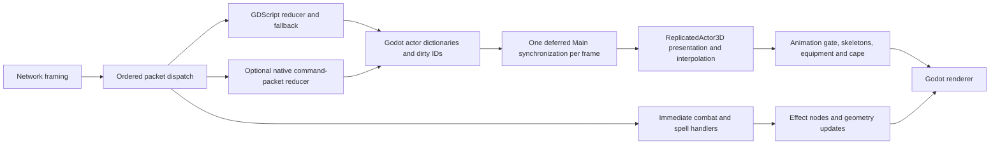

# Native crowd investigation

The branch delivers a working, optional native command reducer and a validated
crowd benchmark suite. Focused command work improved by 26–32%, but there is
no established whole-frame gain and the **300-actor 60 FPS target was not met**.
Healthy primary headless runs still took roughly 34–45 ms per frame. Repeated
diagnostics identify effects and cape/animation presentation as larger remaining
CPU costs; Compatibility rendering is also expensive. Keep the native path
opt-in and investigate those measured costs before expanding native ownership.

The acceptance workload is 300 local actors, 150 camera-visible, and 100 moving
or fighting, including equipped humanoids and the local player. The 60 Hz target
is a **16.67 ms frame budget**. These are shared-machine measurements with
recorded outliers and explicit fixture limits, not a mid-range-machine or visual
parity certification. The shipping renderer and existing presentation remain
unchanged.

## Isolation and measurement contract

- Task branch: `perf/native-crowd-300-benchmark`.
- Task worktree: `C:/Users/User/Desktop/eloria-project/wt-native-crowd-300`.
- Starting fetched `develop`: `a0806f2f2462a87037171042e62a6ed3ff37c760`.
- The primary checkout was already dirty and its local `develop` was at
  `12793bb4372c37ab1ba2de494bb7478595c847c5`. It was not checked out, reset,
  updated, or merged. Only this task branch was advanced to fetched `develop`.
- All task processes share logical processors 0–3: PowerShell launchers set
  `(Get-Process -Id $PID).ProcessorAffinity = 15` before spawning children.
  Builds have an additional explicit job limit. Benchmark jobs run serially;
  compiling and benchmarking must not overlap.
- Generated imports, logs, native dependencies, binaries, and isolated user data
  belong inside this worktree. All three agents shared it; no temporary subagent
  branches or worktrees were created or need cleanup.
- Final checks confirmed both the primary checkout's HEAD and local `develop`
  remain at `12793bb4372c37ab1ba2de494bb7478595c847c5`. Nothing was pushed or
  merged. The final review commit SHA is supplied in the task's final handoff.

Headless measurements remove Godot's idle padding. Windowed measurements use
renderer timers; compositor-paced wall time is diagnostic, not scene CPU.
Unavailable counters must be null, not a misleading zero. Scene CPU, render CPU,
and GPU from separate runs must not simply be added to invent a total frame time.
Sub-millisecond changes require repeated measurements and noise controls.

The user explicitly authorized proceeding while unrelated Godot jobs from
`clean_client` were active. These are **shared-machine measurements**, not an
exclusive-machine 60 FPS certification. The unrelated jobs were not stopped or
reconfigured. Record their observed interference with each run, and compare
before/after under equivalent task affinity and renderer settings.

## Existing architecture and proposed boundary

`EloriaNetworkClient._drain_packets` decodes frames at an offset and emits each
packet in order. `EloriaProtocol.decode_server` expands movement payloads into
command dictionaries. `AppState._on_packet` applies each command through
`ActorReducer`, replacing the touched actor record and marking its ID dirty.
`Main` coalesces those changes into one presentation flush per frame. Its spawn
budget limits new actors to four per pass, with a local-player exception.

`Main._present_actor` resolves the actor's resident-map adapter, builds the
presentation record, updates `ReplicatedActor3D`, and samples changed ground
positions. The actor owns interpolation, gait and jitter histories, animation
one-shots, appearance, equipment and cape presentation. `AnimationGate` retains
full, half-rate and paused animation tiers, with a one-shot exemption. GLB scenes
and retargeted animation libraries remain cached and prewarmed.

The narrow experiment is one native call per command packet, retaining the
existing actor dictionary interface. A separate compact-state prototype can
measure the upside of deferring dictionary materialization, but that result is
not equivalent to the production packet/signal contract. Direct actor-table
readers and synchronous signal observers make a complete ownership migration
a separate design decision.

The optional native path must validate the entire payload before mutation,
preserve unknown-command sequence increments, retain the last directional
command across turn-plus-attack packets, and preserve sparse optional keys and
nested reference sharing. Local disengage packets use the existing path so
listeners retain the exact intermediate state and signal order.

## Decision checkpoints

1. **State reduction:** compare unchanged GDScript, native dictionary reduction,
   and compact typed reduction including export and call overhead. Keep an
   integrated native path only for a repeatable material gain with parity.
2. **Actor presentation:** measure presentation, surface queries, overhead work,
   gate scheduling and residual frame cost separately. Do not port pacing or
   grounding just because they are written in GDScript.
3. **Rendering:** compare Compatibility and Forward+ with the same actor
   composition and actual visibility. Preserve meshes, equipment, effects and
   one-shot behavior in acceptance runs. Feature ablations are diagnostics.
4. **Acceptance:** report the 300-actor case and 100/200/500 scaling with sample
   distributions and unavailable metrics called out. Renderer switches and a
   custom crowd renderer require their own visual and performance evidence.

## Results

### Unchanged packet baseline

Godot `4.7.2.stable.official.ed1daf0bf`, headless, single-threaded scene, affinity
`0xf`. Three fresh processes each ran the historical eight-repeat benchmark.
Times below are milliseconds; a row is the mean produced by the historical
harness, not a per-command latency percentile.

| Run | Decode | Decode + reduction | 2,400 actor commands | Stats | Chat |
| --- | ---: | ---: | ---: | ---: | ---: |
| 1 | 0.624 | 14.937 | 10.378 | 1.027 | 1.747 |
| 2 | 0.558 | 13.466 | 10.009 | 1.153 | 1.608 |
| 3 | 0.562 | 14.752 | 10.462 | 0.975 | 2.115 |
| Median of runs | 0.562 | 14.752 | 10.378 | 1.027 | 1.747 |

The actor component is measured by the historical harness by subtracting a
separate decode-only sample. The component medians therefore need not add to the
full-burst median. The current result is slower than the old ~9 ms actor figure;
the restricted CPU allocation, intervening changes and shared-machine
interference prevent attributing that difference to a regression.

Immediately before these runs, one unrelated Godot process consumed 2.39 CPU
seconds over five wall seconds, another 0.047, and a third started during the
sample. Raw reports and execution records are in
`test-artifacts/native-crowd/baseline/packets-headless-{1,2,3}.*`.
The portable [historical baseline record](benchmarks/native-crowd-develop-baseline-2026-09-19.json)
embeds those reports and the three original crowd runs, with 33 hashed inputs.

The measurement justifies testing command reduction rather than replacing raw
packet framing. The initial keep criterion is a repeatable reduction well
beyond the shared-machine noise, including dictionary publication and the
GDScript/native boundary, with parity checks passing.

### Historical crowd harness reproduced, with a readiness defect

The unchanged 100-creature instrument completed on all three modes. Its
headless result was 1.180 ms idle and 8.527 ms all-moving: 0.507 ms reduction,
4.559 ms presentation and 3.461 ms residual. Spawning took 4,337.9 ms headless.

| Renderer | World render CPU, idle / walk | World GPU, idle / walk | Draw calls, idle / walk |
| --- | ---: | ---: | ---: |
| Compatibility | 1.771 / 1.876 ms | 1.526 / 1.464 ms | 485 / 490 |
| Forward+ | 0.578 / 1.696 ms | 0.491 / 0.489 ms | 477 / 482 |

These are **provisional single-frame renderer readings, not accepted steady
crowd measurements**. The legacy harness waits for `world_root` and a fixed
number of process frames. On current `develop`, map chunks continue loading
asynchronously after that point, including during walking and after the report
is printed. Headless node counts rose from 6,200 idle to 8,123 walking; the
Compatibility run rose from 8,123 to 9,449. Its `renderer` JSON field also reads
the project setting and incorrectly says Compatibility in a CLI Forward+ run;
the renderer startup log is the authority for that comparison.

This explains why reproducing an old benchmark command is not enough to certify
the current workload. The new harness must establish streaming readiness,
sample distributions, and report actual camera visibility before its crowd
numbers can be accepted. No shipping renderer decision follows from this table.

### Verified native reducer experiment

The host is an Intel Core Ultra 9 275HX (24 logical processors), 31.38 GiB RAM,
and an NVIDIA RTX 5080 Laptop GPU with 16 GiB VRAM, driver 591.91, on Windows
build 26100.9457. This is not a mid-range GPU. All task processes are restricted
to logical processors 0–3; unrelated applications remain outside task control.

The final reducer runs explicitly record `OS.get_user_data_dir()` inside the
worktree. Windows honors the process-local `APPDATA` redirection: both direct
and hidden `Start-Process` probes verified it. Earlier native trial launches
lacked that assurance and are superseded. Historical baseline logs and cache
placement support isolation, but do not attest the resolved path per process.
The crowd runner now rejects an unexpected user-data directory before loading
`Main`, whose saved preferences could otherwise affect FPS, camera and effects.

Nine rotated trials compare the same 2,400 command transitions over 24 seeded
actors, matching the historical burst's small actor pool and including
command decoding, native calls and required dictionary publication. Final
states and dirty lists are checked outside the timed interval.

| State path | Median ms | Interpretation |
| --- | ---: | --- |
| Existing GDScript | 12.904 | Equivalent reference |
| Native dictionary reducer | 8.726 | 32.4% below reference; packet boundary preserved |
| Compact store with per-packet publication | 7.749 | Typed ownership prototype, including reset/export |
| Compact store with deferred publication | 0.244 | **Not equivalent to current synchronous observers** |

Separate component passes measured compact per-packet reset/reduction/export
at 0.077/0.765/7.385 ms. Their medians are not additive to the total trials.
Dictionary publication dominates the compact path. The attractive deferred
number cannot be used as a production gain without redesigning ownership and
the packet-observer contract.

Three fresh processes per backend also repeated the historical mixed burst.
The isolated actor-command component fell from a median 9.255 to 6.840 ms
(26.1%). However, full decode-plus-reduction medians were 11.926 ms off and
12.914 ms on. Those independently timed component and whole-burst runs do not
reconcile arithmetically, and the shared-host results do **not** demonstrate a
whole-burst improvement. The original 1–3 ms command objective was not met.
The [native reducer record](benchmarks/native-crowd-reducer-2026-09-19.json)
retains all trials, component timings, parity results and build provenance.

**Decision:** retain the small reducer as an explicit opt-in prototype because
the focused command workload improves materially and parity passes. Keep the
compact store experimental. Do not enable either by default or extend native
ownership into interpolation, surface queries or animation without crowd
measurements showing a net benefit. The current boundary preserves all
existing Godot presentation code, caches, spawn budgets and change coalescing.

## Implementation and ownership

The native target is a C++17 Godot 4.7 GDExtension, built with the repository's
available MinGW toolchain and a pinned, reduced godot-cpp binding profile. There
was no existing Rust integration to reuse. C++ keeps the experiment small and
uses Godot's supported extension interface. Windows Release was built and
executed; Linux build commands are provided but were not validated on this host.
The descriptor is generated only after a successful build, so ordinary source
checkouts retain a working GDScript path without a missing-library warning.

`ELORIA_NATIVE_CROWD=1` opts into `NativeCrowdReducer.reduce_packet(actors,
payload, local_actor_id)`. One call handles one complete command packet and
returns a packed first-touch dirty-ID list. It validates before mutation and
shallow-copies each touched record once. Outer dictionary identity and nested
appearance/equipment references survive. Malformed payloads, corrupt targeted
records and local disengage packets return to the existing decoder/reducer.
The last case preserves synchronous combat observers' intermediate state.

`NativeCrowdStore` separately owns contiguous typed hot records and a fixed
65,536-entry ID-to-slot index (256 KiB). Removal swaps the last record into the
vacated slot; reset prevents stale state when IDs are reused. Dirty snapshot
export retains unpublishable records for a later retry. Cold appearance,
equipment, names and map data remain with the caller. This store is deliberately
not authoritative in AppState: external writers still mutate hot fields, and
packet listeners still expect published dictionaries after each packet.

Godot retains networking transport/framing, packet types other than actor
commands, authoritative dictionaries, interpolation and teleport handling,
local prediction, combat one-shots, skeletons, equipment, cape presentation,
surface sampling, camera/input/audio/UI, effects, world streaming and rendering.
The prototype adds no per-property native transform calls. Godot's existing
full/half/paused animation gate and 80 m actor draw range remain in force.
The harness counts actual camera-frustum intersection separately from draw
range; it does not equate all actors inside 80 m with visible actors.

No additional production interpolation, grounding, overhead or rendering
optimization is bundled into the reducer result. Their before/after status is
therefore **unchanged**, rather than an unmeasured gain attributed to native
code. Diagnostic feature removals and frozen animation poses are attribution
experiments, not acceptable gameplay configurations.

The architecture should retain an explicit fidelity policy, without pretending
that a new tier implementation has been measured on this branch:

| Actor category | Retained behavior and next decision |
| --- | --- |
| Local player / selected or critical actor | Keep full `ReplicatedActor3D` behavior, prediction and one-shot semantics; do not replace it with the compact prototype. |
| Near visible | Preserve individual bodies, equipment and full animation. The native command path can feed the existing dirty presentation flush. |
| Mid-distance visible | Reuse the existing half-rate gate beyond 45 m from the camera. Additional bone or mesh LOD requires authored assets and visual checks. |
| Distant visible | Keep the current 80 m draw policy; the zoom/range diagnostics measure the existing gate. No impostor or reduced-skeleton assets are implemented here. |
| Outside the frustum | Retain authoritative state and the existing paused animation tier, including its one-shot exceptions. Future event/pose scheduling must preserve re-entry phase and combat timing. |

Humanoid equipment already binds to the actor skeleton and uses cached rebound
skins and draped cape meshes. A proposal to merely share that same skeleton or
add another GLB cache would duplicate existing work. Ordinary `MultiMesh` also
does not provide independent poses for these heterogeneous skinned actors.
Mesh/material consolidation, bone LOD or a custom animated instancing path must
demonstrate a benefit beyond the existing caches and Forward+ renderer while
retaining race, armor, weapon and shield identity. None is shipped speculatively.

## Measurement boundaries

The fixture uses real models and two complete humanoid equipment kits. The
primary workload puts all 100 active remote actors inside the 150 visible
actors, keeping the local player stationary. This is a deliberately dense
visible workload. It is synthetic, with a declared 100 ms movement cadence,
not a captured server trace. Additional composition, visibility and activity
cells establish which conclusions transfer to other populations.

The creature-heavy preset is 299 model-backed creatures plus one local equipped
humanoid. It uses default 1×1 actor footprints and reserves unique anchor tiles;
it does not certify multi-tile footprint occupancy or collision behavior.
Selection is requested for a known actor, but the fixture does not assert the
marker geometry or its movement. The original range and zoom cells record
distance and animation-tier counts without asserting an expected tier split;
the supplemental `lod_bands` cell adds that assertion. Zoom creates a new layout at
the changed camera distance; it is not a same-layout zoom-culling comparison.
These are presentation-load diagnostics with explicit scope limits.

Headless wall intervals are an uncapped scene-tree CPU proxy, including
instrumentation and host scheduling. Window wall intervals remain diagnostic.
Viewport render timers are asynchronous observations of completed renderer
work, not a synchronized CPU/GPU trace of the same frame. All screenshots are
taken after the measured interval; an early GL smoke demonstrated that a
pre-sample screenshot readback can appear in the next reported GPU timestamp.
Those smoke timing distributions are superseded, not silently trimmed.

Final cells request at least 2.5 seconds and 60 measured frames after warmup and
world-readiness checks. Slow cells extend beyond 2.5 seconds to reach that frame
count. Percentiles use the harness's nearest-rank rule; with only 60 frames,
p99 is the maximum observation. These short trials detect large costs and
stalls, but do not replace a sustained gameplay or thermal-stability test.

The command-only timer excludes other packet types. The inclusive packet
dispatch timer also contains synchronous spell/animation presentation handlers.
Presentation, world-sync, overhead and animation-gate timers overlap and must
not be added together. Independent animation blending, skeleton evaluation and
GPU skinning counters are unavailable in this instrument; a frozen-animation
diagnostic provides a combined cost difference, not a precise skinning counter.

Spawn memory is captured before allocating the timed telemetry arrays. Memory
retained after despawn explicitly includes benchmark records, telemetry and
shared caches; it is not evidence of an actor leak. Texture memory is a Godot
renderer counter, not total process GPU residency. All unavailable metrics
remain null. These distinctions prevent a fast isolated reducer or a low GPU
timer from being presented as an achieved 16.67 ms end-to-end frame budget.

## Final primary acceptance measurements

Final acceptance uses the corrected `deferred-coalesced-role-faithful-v2`
driver at measurement commit `b0cf3f08e242e87bfb15da7e76e30e87d275e9f0`. It retains
300 actors, 150 visible actors, and 100 active actors: 50 moving, 24 melee,
13 spellcasting and 13 ranged. All timed actor presentation uses Main's real
deferred queue, verified to run at most once per measured frame. The native
reducer and all production presentation code are unchanged by this correction.

The earlier 18-process `final-primary` series and the initial scaling series
are superseded. They passed actor/visibility/equipment checks, but their driver
forced a presentation flush before the real deferred flush, inflated some CPU
costs, and combined melee commands with spell/ranged events on the same actor.
These results are not accepted as production-faithful performance evidence.
The summarizer rejects that older format unless explicitly invoked with the
legacy diagnostic opt-in. Raw data and prior compact summaries remain locally
available for audit; they are not mixed with corrected trials.

The separate reducer and lifecycle experiments do not instantiate this driver
and remain valid. The corrected primary smoke verified the same visible
composition and normal action roles, and 500-actor asynchronous and all-moving smokes
verified real coalescing under multiple elapsed server ticks.

All 18 final primary processes passed the fixture and execution checks at runtime
source hash `dcd930f19ce1ec9857c3b5a546b082aaf00a0ed4fa99ffea373d9d10d0311480`.
They observed 300 grounded actors at the pre-sample fixture check, zero equipment
fallbacks, and at most one world synchronization per measured frame. The primary target was **not met**:
even the healthy headless runs exceed 16.67 ms before considering a complete
rendered frame. There is no established whole-frame native improvement.

Later matrix/stress artifacts record `dirty: true` because the analytical
Python summarizer and documentation were being improved while timing continued. The measured
runtime files and composite hash remained unchanged. That hash covers the
runner's explicit manifest, including the extension descriptor and DLL; it is
not a hash of every asset or script. Other tracked runtime files stayed at the
measurement commit. Report/process dirty flags are checked for equality, and
the final review commit includes the analytical changes separately from the
recorded measurement commit.

The following values are medians across three process results. The mean column
is the median of process means; p95 and p99 are medians of each process's own
percentiles, not pooled frame percentiles. Headless wall time is the scene CPU
proxy, including scheduling and instrumentation.

| Headless backend | Mean ms | p95 ms | p99 ms | Worst observed frame ms |
| --- | ---: | ---: | ---: | ---: |
| GDScript | 45.089 | 64.540 | 77.267 | 2,119.572 |
| Native command reducer | 35.476 | 52.669 | 58.748 | 61.135 |

The three GDScript means were **235.847, 35.679, 45.089 ms**; native means were
**35.476, 33.740, 37.835 ms**. The first GDScript sample required 14.162 seconds
to collect 60 frames and accumulated 260 live effects, versus 78 in every other
primary process. Its worst frame was over two seconds. It remains in the
evidence; removing it after seeing the result would conceal overload sensitivity.
The healthy second GDScript process closely matches native. Shared-host activity
was not continuously monitored, so neither this outlier nor the apparent median
difference can be attributed solely to the reducer.

| Headless component, ms per frame | GDScript | Native |
| --- | ---: | ---: |
| Actor-command reduction | 0.227 | 0.126 |
| Packet dispatch, inclusive of immediate effect handlers | 0.995 | 0.654 |
| Actor presentation, excluding ground sampling | 1.318 | 0.877 |
| Surface grounding | 0.242 | 0.169 |
| Overhead updates | 0.388 | 0.249 |
| Animation gate scheduling | 0.465 | 0.298 |
| World synchronization, inclusive | 2.208 | 1.473 |

These timers overlap and describe only instrumented entry points. They do not
account for the full scene frame or isolate AnimationPlayer blending, skeleton
evaluation, cape modifiers, effects, and engine traversal. Ordinary command
reduction is already a small fraction of the representative frame. On frames
carrying packets, command/dispatch medians were 0.504/2.212 ms for GDScript and
0.357/1.856 ms for native; averages across every frame would hide those spikes.

| Windowed renderer / backend | World render CPU ms | World GPU ms | Draw calls |
| --- | ---: | ---: | ---: |
| Compatibility / GDScript | 18.433 | 17.111 | 3,670 |
| Compatibility / native | 21.675 | 22.953 | 3,674 |
| Forward+ / GDScript | 6.712 | 2.585 | 2,462 |
| Forward+ / native | 6.320 | 7.791 | 2,460 |

Forward+ consistently reduces render CPU and draw calls in this fixture.
GPU readings vary considerably: Forward+ process means span 1.710–10.971 ms
across both backends, while Compatibility spans 16.359–23.548 ms. The native
reducer changes no rendering code, so renderer differences between native and
GDScript modes are not a rendering optimization. The window wall interval is
compositor-paced and is not a valid isolated CPU measurement. There is no
synchronized end-to-end frame trace; the headless, render CPU, and GPU columns
must not be added into a purported total frame time.

Across the three processes per backend, Compatibility's GPU p99 ranged from
19.556–43.000 ms for GDScript and 32.228–46.100 ms for native. Forward+ ranged
from 1.967–12.588 ms and 12.609–25.740 ms respectively. These tails and the
cross-process variation prevent using a favorable GPU mean as a stable 60 Hz
claim. The full per-run distributions remain in the JSON.

Scene creation took a median 4,252.9/4,347.2 ms and teardown 924.0/819.9 ms for
GDScript/native. Both created 15,444 nodes and 27,001 objects above the pre-spawn
measurement. Static memory grew by about 1,138.5 MiB; about 244.9 MiB remained
after despawn, including the fixture's telemetry and shared caches. These are
scene lifecycle and retained-resource observations, not native storage gains or
proof of a leak. The [primary evidence](benchmarks/native-crowd-primary-2026-09-19.json)
retains each process's distributions, workload rates, counts and provenance.

At the post-spawn snapshot, Compatibility reported 366.9 MiB of texture memory
and approximately 806–808 MiB of renderer video memory; Forward+ reported
422.4 MiB and approximately 790.0 MiB. These are Godot counters, not measured
total GPU residency. Both backend modes were effectively identical at that
snapshot, so the prototype demonstrates no renderer-memory reduction.

Post-timing [Compatibility](benchmarks/native-crowd-primary-compatibility.png)
and [Forward+](benchmarks/native-crowd-primary-forward-plus.png) captures show
the dense mixed crowd, equipment, health/name overlays and active effects.
The layouts deliberately place actors in two bands. Frustum visibility is not
an occlusion query: some actor pixels can be covered by scenery or other actors.
Overhead overlap is severe in this density. Forward+ is visibly brighter in
these captures, including the particles; they were taken at different effect
phases and do not establish pixel parity. A renderer change requires a separate
lighting/material/effect and gameplay review. The shipping renderer is unchanged.

## Population and activity scaling

The corrected mixed-crowd matrix is a separate single process per renderer,
with each cell warmed and sampled independently. The following headless values
are **mean / p95 / p99 milliseconds**. They are not repetitions of the primary
backend comparison and must not be presented as a before/after improvement.

| Actors | Idle | About one-third moving/fighting | All moving |
| ---: | ---: | ---: | ---: |
| 100 | 4.29 / 5.06 / 6.38 | 9.57 / 13.09 / 16.88 | 5.15 / 9.68 / 11.52 |
| 200 | 9.83 / 12.19 / 14.12 | 22.86 / 33.74 / 41.33 | 14.79 / 24.92 / 27.04 |
| 300 | 13.83 / 15.98 / 17.01 | 32.07 / 48.29 / 58.81 | 31.60 / 50.94 / 56.79 |
| 500 | 23.90 / 26.76 / 28.90 | 62.76 / 94.52 / 110.84 | 101.39 / 123.28 / 130.56 |

All twelve cells passed the fixture and coalescing checks. All-moving command
rates were approximately 998/1,994/2,998/4,928 per second. The mixed-activity
cells produced approximately 25/47/73/111 visual events per second and peaked
at 30/54/78/126 live effects; idle and all-moving cells had no combat effects.
This is why a one-third combat workload can be more expensive than all walking
at smaller populations. At 500 actors, all-moving frame cost scales worse than
linearly and requires its own update/animation profiling. Even 300 idle actors
cross 16.67 ms at p99 before a complete rendered frame is considered.

The matching renderer table reports **mean CPU ms / mean GPU ms / draw calls**.
Each renderer has one process for this matrix; these are descriptive samples.

| Actors / activity | Compatibility | Forward+ |
| --- | ---: | ---: |
| 100 idle | 4.950 / 4.308 / 1,164 | 1.400 / 0.784 / 878 |
| 100 one-third active | 5.447 / 5.314 / 1,246 | 2.148 / 0.806 / 951 |
| 100 all moving | 5.227 / 4.514 / 1,163 | 1.644 / 0.791 / 877 |
| 200 idle | 10.077 / 8.935 / 2,199 | 3.314 / 1.234 / 1,581 |
| 200 one-third active | 11.562 / 10.001 / 2,376 | 4.073 / 1.268 / 1,715 |
| 200 all moving | 11.039 / 10.212 / 2,198 | 3.513 / 1.249 / 1,580 |
| 300 idle | 15.828 / 14.098 / 3,214 | 5.149 / 1.662 / 2,283 |
| 300 one-third active | 18.052 / 16.275 / 3,676 | 6.518 / 3.767 / 2,466 |
| 300 all moving | 19.867 / 20.428 / 3,213 | 5.762 / 14.089 / 2,282 |
| 500 idle | 31.596 / 29.629 / 5,264 | 9.955 / 2.512 / 3,688 |
| 500 one-third active | 34.417 / 37.588 / 5,691 | 12.223 / 15.946 / 3,996 |
| 500 all moving | 40.610 / 51.064 / 5,263 | 10.691 / 30.155 / 3,687 |

Forward+ reduces render CPU across the matrix, but its 300/500 all-moving GPU
readings still become expensive. The current counters cannot separate GPU
skinning, pose uploads, vertex work and scheduling stalls. Stable draw counts
between idle and walking do not imply stable GPU cost. The
[scaling evidence](benchmarks/native-crowd-matrix-2026-09-19.json) preserves all
frame distributions, renderer primitives, memory and workload counts.

### Continuous combat saturation

Every actor in these separate cells fights, with distinct melee, caster and
ranged roles on the declared 400 ms schedule. This is an effects-heavy stress
case, substantially more demanding than the primary 50-fighter workload.
Each population has one headless and one Forward+ process.

| Actors | Headless mean / p95 / p99 ms | Forward+ render CPU / GPU ms | Peak live effects, headless / F+ |
| ---: | ---: | ---: | ---: |
| 100 | 58.253 / 105.257 / 132.586 | 3.054 / 6.858 | 150 / 150 |
| 200 | 139.672 / 235.796 / 256.178 | 6.042 / 15.599 | 350 / 302 |
| 300 | 207.154 / 318.097 / 344.610 | 19.715 / 32.707 | 603 / 1,665 |
| 500 | **Failed bounded sample** | **Failed bounded sample** | 4,144 / 4,125 |

The 100/200/300 cases collected 60 frames and passed formal fixture checks;
that means valid measurements, not acceptable performance. Their corresponding
Forward+ diagnostic wall means were 73.658/141.708/538.441 ms. The 300 case
accumulated 1,665 effects and synchronized only 1.763 times per second against
a nominal 2.5 combat ticks per second, demonstrating substantial catch-up work.

At 500, headless stopped after 19 frames and 17.13 seconds; Forward+ stopped
after 9 frames and 14.45 seconds. Both deliberately exited with code 2 after
crossing the live-effect limit. Neither had a script error, monitoring failure
or forced termination. The process records correctly mark them invalid, and
their partial means/renderer counters are excluded from accepted tables.

Effect lifetime in local code advances through `_process(delta)`, while the
fixture schedules server events from monotonic wall time and catches up overdue
ticks before yielding. This is a concrete overload sensitivity. The records do
not establish whether engine-supplied delta lagged wall time. Before changing
expiry semantics, record actual process delta alongside wall time, catch-up
ticks, separate effect creation/free counts and live-effect ages. Current event
counts combine caster effects and ranged animation requests, so they are not
an exact effect-allocation counter. Do not infer a universal live-server actor
threshold from this synthetic cadence.

Portable evidence: [100 combat](benchmarks/native-crowd-combat-100-2026-09-19.json),
[200 combat](benchmarks/native-crowd-combat-200-2026-09-19.json),
[300 combat](benchmarks/native-crowd-combat-300-2026-09-19.json), and the
[500-actor failed stress cases](benchmarks/native-crowd-combat-500-failure-2026-09-19.json).

## Composition, visibility and update cadence

The creature-heavy diagnostic contains 299 creatures and the local equipped
humanoid. With 150 visible and 100 active, headless mean/p95/p99 were
20.903/34.610/38.349 ms. Forward+ render CPU/GPU/draw means were
3.192 ms / 1.855 ms / 1,698. This is cheaper than the mixed or fully equipped
humanoid populations but still misses the CPU frame budget. It is a model and
presentation comparison, with the default-footprint limitation described above.

| 300-actor mixed visibility fixture | Actually visible | Headless mean / p95 / p99 ms | Forward+ CPU / GPU ms | Draw calls |
| --- | ---: | ---: | ---: | ---: |
| Concentrated | 300 | 70.345 / 91.852 / 128.081 | 11.826 / 8.642 | 4,571 |
| Original `range_bands` preset | 150 | 41.835 / 62.301 / 85.537 | 6.124 / 1.730 | 2,466 |
| Zoomed out, newly arranged layout | 300 | 56.750 / 79.806 / 86.070 | 12.120 / 10.890 | 4,003 |

The original `range_bands` fixture actually produced 225 actors within 45 m,
zero at 45–80 m and 75 beyond 80 m. Its label therefore overstates its distance
coverage: it measures nearby/off-frustum/beyond-draw behavior, not all distance
bands. The census makes that limitation visible rather than hiding it behind
the requested configuration name. Concentrated and zoom cells do not hide
actors to achieve their timing; both retain 300 actually visible actors.

The separate **`lod_bands` supplement** closes the missing middle-distance
coverage. Its two processes ran at commit
`c55dcc92fe25498f701fad42d37a735d51b2e956`, with runtime source hash
`57cad370baf64713c4938728f99655cc21b1b66de79d6f8855419324b962c8bf`.
The new preset leaves the earlier presets intact; those earlier measurements
retain their original commit and hash. It uses supported camera settings:
distance 32 m, pitch −25°, yaw 0°, and the recorded 50° field of view.

Both initial fixtures assert **100 near / 100 middle / 100 beyond-range actors**
and **100 full / 100 half-rate / 100 paused animation tiers**. Exactly 200 actors
are in both the frustum and draw range throughout the sample; all 300 pass the
initial ground check. The windowed after-sample tiers are 101/99/100 because a
live one-shot retains full animation, as the existing gate requires. The
validator checks the initial contract without rejecting that correct transition.

Headless mean/p95/p99 were 47.820/70.605/76.959 ms. Forward+ render CPU/GPU/draw
means were 8.185 ms / 6.645 ms / 3,121; GPU p95/p99 were about 16.16/16.48 ms.
This is coverage of the existing gate under a different layout and camera,
not a measured gain from implementing new LOD. See the
[LOD-band evidence](benchmarks/native-crowd-diagnostics-lod-bands-2026-09-19.json).

The 25%-moving diagnostic has no combat effects and drives 25/50/75/125 moving
actors, at approximately 250/499/748/1,241 commands per second:

| Actors | Headless mean / p95 / p99 ms | Forward+ CPU / GPU ms | Draw calls |
| ---: | ---: | ---: | ---: |
| 100 | 5.936 / 8.257 / 9.491 | 1.685 / 0.783 | 878 |
| 200 | 14.584 / 19.288 / 19.894 | 3.660 / 1.238 | 1,581 |
| 300 | 20.328 / 26.308 / 27.305 | 4.895 / 1.668 | 2,283 |
| 500 | 43.563 / 54.342 / 61.010 | 8.605 / 2.513 | 3,688 |

A separate 300-actor normal-versus-asynchronous comparison held command rates
close (566 versus 561 per second headlessly) while increasing packet callbacks
from 83 to 174 per second. Headless mean/p95/p99 changed from
43.152/62.644/70.317 to 37.959/53.597/61.087 ms; Forward+ render CPU changed
from 6.783 to 7.618 ms. The real coalescer handled at most one synchronization
per frame in both modes. Different flush frequency and opposite CPU trends
across modes reinforce that these single trials establish load coverage, not
a reliable asynchronous-pacing speedup.

Evidence: [creature-heavy](benchmarks/native-crowd-diagnostics-creature-300-2026-09-19.json),
[visibility](benchmarks/native-crowd-diagnostics-visibility-300-2026-09-19.json),
[25% moving](benchmarks/native-crowd-diagnostics-move-25-2026-09-19.json), and
[asynchronous cadence](benchmarks/native-crowd-diagnostics-async-2026-09-19.json).

## Network and protocol stress

Six 500-actor mixed-crowd variants passed their 60-frame sample, decode and
coalescing checks in headless and Forward+ modes. These are single-process
descriptions of different workloads, not paired optimization trials.

| Network variant | Headless mean / p95 / p99 ms | Forward+ CPU / GPU ms |
| --- | ---: | ---: |
| Normal synchronized movement batches | 89.265 / 137.192 / 161.471 | 11.717 / 8.736 |
| Asynchronous movement groups | 79.088 / 116.717 / 136.155 | 12.189 / 15.173 |
| Folded turn plus attack | 86.841 / 138.514 / 161.778 | 14.066 / 20.858 |
| Health and buffs | 100.233 / 149.997 / 170.194 | 11.476 / 11.559 |
| Repeated unchanged equipment | 73.563 / 109.026 / 127.491 | 12.125 / 21.782 |
| Equipment wear/unwear changes | 79.429 / 134.750 / 153.062 | 13.975 / 20.608 |

Command rates remained around 921–1,032 per second headlessly; presentation
events remained around 105–110 per second. Asynchronous movement spreads each
actor's 100 ms update cadence across ten groups, producing more packet callbacks
and up to one real presentation flush each measured frame. It does not force
an extra flush per overdue tick. Forward+ GPU p99 was approximately 41–43 ms
across these variants despite much lower means. Their ordering and variability
do not establish that equipment changes or asynchronous updates are faster.

The fixture verifies decoding and unchanged-equipment identity. It does not
independently assert every resulting health/buff value, wear/unwear visual,
folded-facing pose or per-actor asynchronous fairness. Those rows establish
dispatch/presentation load; native reducer parity supplies the separate command
state proof. They are not comprehensive end-to-end protocol acceptance tests.

A separate contiguous-buffer burst reads 500 actor-command frames with eight
commands each: **4,000 commands over 24 actors**, repeated eight times. Headless
GDScript mean decode/full times were 0.556/21.524 ms for movement and
0.629/22.241 ms for turn/attack. The windowed process observed
0.488/21.231 and 0.691/22.487 ms. This loops protocol framing and AppState
reduction directly, excluding socket I/O and Main presentation. It is distinct
from the historical mixed 500-packet/**2,400-command** benchmark and supplies
no native comparison. Both raw distributions and verified summary statistics
are preserved in the [packet-burst record](benchmarks/native-crowd-packet-bursts-2026-09-19.json).
The [network stress record](benchmarks/native-crowd-stress-2026-09-19.json)
contains the complete crowd and packet-rate evidence.

## Feature attribution and the next CPU target

The feature fixture uses **300 equipped humanoids**, 150 visible and 100 active.
It is heavier than the mixed primary population. Every ablation retains the
same actor census and normal protocol workload. Full, no-effects, no-cape and
frozen-animation cases were repeated in two rotated orders after the first
seven-feature run. All passed workload, ground, coalescing and execution checks.

| Headless scene CPU proxy, mean ms | First run | Rotated A | Rotated B |
| --- | ---: | ---: | ---: |
| Full presentation | 69.10 | 53.75 | 47.96 |
| Effects disabled | 37.60 | 33.14 | 31.41 |
| Cape removed | 40.93 | 34.87 | 34.12 |
| Animation frozen | 48.69 | 43.96 | 42.36 |

Across each run's own full reference, effects removal reduced the CPU proxy by
34.5–45.6%, cape removal by 28.9–40.8%, and animation freezing by 11.7–29.5%.
Absolute full timings drifted from 69.10 to 47.96 ms, so the range and consistent
direction are more useful than a claimed precise speedup. The costs overlap;
these deltas cannot be added. Full/no-effects/no-cape/no-animation p99 values
were 119.96/61.65/78.81/71.16 ms initially and
76.76/49.00/64.30/68.42 ms in the final rotated run.

The other single headless diagnostics were bare equipment 38.27 ms, no overhead
64.83 ms, and no ground sampling 53.74 ms, against the first full 69.10 ms.
Those have no rotated repetitions and weaker attribution. In particular, the
ordinary primary ground timer is only 0.242 ms/frame; the large single no-ground
delta cannot establish that terrain queries consume the whole difference.
Keep grounding intact and investigate its measured query count and movement
dependence before introducing spatial approximation.

| Humanoid feature | Compatibility CPU / GPU ms | Forward+ CPU / GPU ms | Draw calls, GL / F+ |
| --- | ---: | ---: | ---: |
| Full | 33.80 / 34.86 | 8.39 / 9.53 | 5,258 / 3,136 |
| Effects disabled | 24.64 / 22.59 | 7.31 / 2.28 | 5,076 / 2,963 |
| Cape removed | 23.59 / 23.16 | 7.65 / 2.30 | 4,946 / 2,843 |
| Animation frozen | 26.54 / 25.61 | 8.27 / 2.35 | 5,243 / 3,134 |
| Overhead disabled | 26.16 / 25.82 | 7.50 / 4.39 | 4,355 / 2,243 |
| Bare equipment | 15.82 / 16.19 | 5.01 / 2.19 | 2,594 / 2,310 |

These renderer cells are single runs and asynchronous timers. The full
Forward+ GPU p99 was 30.61 ms; no-effects/no-cape/no-animation were
2.50/4.67/2.56 ms. This suggests presentation-sensitive GPU spikes, but does
not isolate skinning, translucent overdraw, or driver scheduling. Overhead
removal saves roughly 900 draw calls in both renderers even though its single
CPU delta is modest. Equipment is therefore not the only source of draw calls.

The full fixture applies 2,100 equipment visuals with zero fallbacks. Removing
only capes removes 300 of those visuals; bare removes all of them. Live world
effects peak at 78 in the full and single-ablation cells, and at zero only in
the no-effects diagnostic. Animation freezing retains equipment meshes, cape
modifiers and gate classification, but removes animation advancement and some
animation-driven cues. Cape removal changes geometry, skinning and cloth work
together. Neither is an independent engine skinning counter, and none of these
diagnostics is accepted as an optimized gameplay mode.

Code inspection identifies two small, behavior-preserving follow-up boundaries:

1. **Effect geometry:** `WorldEffect3D` and `SpellFlight3D` rebuild ImmediateMesh
   geometry and allocate small point/UV arrays during active frames;
   `CombatPresentation3D` rebuilds geometry on skeleton updates. Instrument
   those builders and count emitted vertices before choosing native code.
   Preserve identical vertices and event timing while eliminating temporary
   arrays if those builders dominate. World particles already use
   `GPUParticles3D`, spell materials already have a cache, and actor combat
   meshes already persist; duplicating those mechanisms would not address the
   remaining work. Per-event world-effect list filtering is another candidate
   for burst spikes, requiring its own measured counter.
2. **Cape pose access:** the existing solver can read up to 192 capsule-endpoint
   global bone poses per active cape per frame, repeatedly fetching the same
   body/leg poses. Snapshot the anchor, four capsule endpoint pairs and rest
   transforms once per modifier pass in GDScript first. Preserve constraint
   order, collision rules, reset/teleport behavior and all bone outputs. If
   profiling still attributes material cost to custom arithmetic afterward,
   test one native batch for the 12 simulated points and output poses, with
   frame-by-frame parity. Moving the whole SkeletonModifier would be a larger
   change; engine animation and skinning are already native.

The cape currently remains active in the HALF animation tier and stops in the
PAUSED tier. Lowering cloth frequency is a separate visual-quality experiment,
not a free substitute for pose caching. Existing draped-mesh, skin, GLB and
animation-library caches remain useful and are retained.

See the [feature evidence](benchmarks/native-crowd-features-2026-09-19.json),
[rotated A](benchmarks/native-crowd-features-repeat-a-2026-09-19.json) and
[rotated B](benchmarks/native-crowd-features-repeat-b-2026-09-19.json).

## Remaining costs, in measured priority order

1. **Presentation CPU and effect accumulation.** The representative mixed
   workload already exceeds the frame budget in headless mode. Repeated
   humanoid ablations put effects first (34.5–45.6% frame reduction when
   removed), capes next (28.9–40.8%), and frozen animation next
   (11.7–29.5%). These are overlapping whole-frame differences, not additive
   profiler samples. Continuous-combat failure adds an effect-lifetime and
   scheduling problem to the geometry-cost investigation.
2. **Rendering, especially Compatibility.** Primary Compatibility render CPU
   and GPU means each approach or exceed the complete frame budget. Forward+
   improves the matrix substantially, but retains expensive movement and
   combat tails. It is the appropriate comparison point before building a
   custom renderer, subject to visual review.
3. **Large moving populations and lifecycle spikes.** All-moving headless
   cost grows from 5.15 ms at 100 to 101.39 ms at 500; per-frame actor update,
   animation and engine work need finer attribution. Primary scene creation
   takes roughly four seconds and more than a GiB of additional static memory.
   Preserve the existing spawn budget and caches while measuring these costs.
4. **Overhead rendering and burst publication.** Overhead removal saves about
   900 draw calls in the humanoid fixture. Ordinary overhead CPU and command
   reduction are much smaller than total scene cost, but command bursts still
   cost milliseconds and dictionary publication limits compact native storage.

Ground sampling and gate classification are individually measured but are not
established as dominant in the representative case. This ordering distinguishes
repeated ablations from single-run diagnostics and source-inspection hypotheses.

## Before and after by intervention

| Intervention | Measured outcome | Status |
| --- | --- | --- |
| Native command packet reduction | 12.904 → 8.726 ms in rotated focused trials; historical actor component 9.255 → 6.840 ms | Opt-in prototype; parity passes; no established full-burst or full-frame gain |
| Compact native state with publication after each packet | 7.749 ms in the focused experiment; export dominates | Benchmark-only ownership prototype |
| Deferring compact-state publication | 0.244 ms but changes synchronous observer semantics | Rejected as a production-equivalent gain |
| Native interpolation, grounding, scheduling or transform output | No implementation or before/after claim | Deferred until measured attribution warrants migration |
| New animation/mesh LOD | No implementation; diagnostic freezes/removals only | Existing gate and actor identity retained |
| Custom native rendering | No implementation; Compatibility/Forward+ comparison measured | Shipping renderer unchanged |

## Correctness and regression status

The focused regression run passed **12 of 16 checks**. All three new native
parity suites passed, including randomized command streams, every command byte,
dirty ordering, sparse fields, reference identity, malformed-packet atomicity,
local disengage signal ordering, compact-store removal and ID reuse. Runtime
performance and adjacent-map actor tests passed with the reducer both off and
on. Draw distance, animation gating and looping, combat presentation, and
equipment-fit checks also passed.

Four checks remain failing: the static GDScript reference guard, protocol,
actor-facing, and Sunmane grounding. The three runtime failures reproduce with
native reduction disabled. Their relevant production and test files match the
starting develop blobs; the static guard's seven remaining failure groups also
concern existing references. This supports classifying them as inherited,
but a separate pristine historical checkout was not executed. The branch does
not claim an entirely green repository suite or repair unrelated failures.
The guard was taught to recognize actual C++ `ClassDB` method bindings instead
of using a blanket native-method allowlist, eliminating the new false positives.
See [the regression record](benchmarks/native-crowd-regressions-2026-09-19.json)
for exact test names, failures, source comparisons and execution metadata.

The final static-reference recheck again produced the same seven existing
failure groups, with no new crowd-harness reference failure.

Ten additional permanent Python tests pass for the evidence exporter. They
reject mismatched averages/tails, non-finite raw values, incomplete or failed
process attestations, dirty-state mismatches and invalid LOD band/tier censuses,
and ensure feature cells remain
visible in Markdown when a simple scaling projection would be ambiguous. The
exporter recomputes raw distributions using the harness's nearest-rank rule;
it does not merely trust a report's claimed averages.

The first broad matrix is also excluded: its all-moving/all-combat driver
encountered a typed-array runtime error, and some 500-actor camera placements
shared a server tile. Correcting a fixture requires rerunning the affected
matrix, not accepting its low timings. The revised runner checks its own
captured executable only, records its path/start time/affinity, and rejects
script errors even when Godot exits with code zero. Workload checks now require
observed command and movement/combat work in addition to requested actor counts.

## Reproduction and review

### Budgets for the next iteration

This laptop GPU is much faster than a mid-range target. Use the following
independent engineering gates at 1280×720 and the same four-core CPU allocation
to leave headroom, then verify a synchronized frame trace on an actual target
machine. These are proposed acceptance budgets, not measured wins or a promise
that a slower GPU will scale proportionally.

| Component | Proposed development-host gate |
| --- | --- |
| Headless scene CPU proxy, full primary fixture | Mean ≤8 ms; p95 ≤10 ms |
| Render CPU, full primary fixture | Mean ≤3 ms; p95 ≤4 ms |
| World GPU, full primary fixture | Mean ≤6 ms; p95 ≤8 ms |
| Normal packet dispatch, including immediate handlers | Mean ≤0.5 ms/frame; inspect packet-bearing p95 separately |
| Integrated 2,400-command burst, including publication | ≤3 ms, with parity and no observer deferral |
| End-to-end rendered frame on the mid-range target | 16.67 ms budget, with p95/p99 and stalls reported |

These overlapping CPU and asynchronous renderer counters are not additive.
The complete scene and end-to-end gates take precedence over meeting isolated
subsystem budgets. Both the current scene CPU and Compatibility rendering miss
the proposed gates substantially; Forward+ still needs CPU and tail work.

### Architecture recommendation

Continue with **Godot plus a narrow, measured native boundary**. This prototype
is not sufficient for the 300-actor target yet. It establishes a repeatable
benchmark and a useful command-reduction experiment, while the actual crowd
cost remains concentrated in presentation and rendering. There is no evidence
here supporting a standalone-client rewrite.

Keep the reducer opt-in and the typed store experimental. First profile and
optimize effect geometry and redundant cape pose access without changing
appearance or event timing. Rerun the full primary workload after each change.
Then review Forward+ visual compatibility and investigate overhead draw
batching and authored animation/mesh LOD while preserving near-actor identity.
Grounding, ordinary packet framing and native visibility classification are
lower priorities given the current measurements. A custom skinned crowd
renderer becomes justified only if render CPU/GPU remains dominant after those
smaller changes and it beats the existing Forward+ path with visual parity.

### Commands and evidence

The review bundle contains 20 portable JSON evidence files. The crowd summaries
cover 44 validated processes and 123 sampled cells; the two rejected 500-combat
processes are kept separately. Native microbenchmarks, historical reproduction,
lifecycle batches and correctness records are additional evidence, not folded
into those crowd timing aggregates. All study links and JSON files were checked.
The final audit also verified 135 linked input-file attestations and all 44
accepted process records, including exact executable identity, affinity mask
15, successful exits and absence of forced stops or monitoring errors.

Build instructions, the pinned dependency, Windows commands and untested Linux
commands are in [the native extension README](../native/native_crowd/README.md).
The extension remains optional and disabled by default. Benchmark profiles,
configuration switches, counter definitions and the four-core runner are in
[the benchmark guide](native-crowd-benchmarks.md). Actor arrival/removal uses
[the lifecycle benchmark](benchmarks/native-crowd-lifecycle.md).

Raw logs, per-frame JSON, screenshots, build products, dependency checkouts and
isolated user-data caches remain under the task worktree's ignored artifact
directories. Compact JSON evidence under `docs/benchmarks` travels with the
review branch and retains input hashes, source provenance and per-run
distributions. `scripts/summarize_crowd_benchmarks.py` selects an exact run label,
rejects incomplete or mismatched workloads, and never combines different source
hashes or silently pools percentiles. Superseded smoke and failed-matrix data
remain available locally for audit.

## Stress bounds and superseded overload evidence

An earlier forced-presentation 500-actor combat test accumulated 27,096 effects and
failed to collect 60 frames. That overload belongs to the superseded driver and
cannot establish the live client's threshold. The corrected stress runs retain
all incoming events and instead stop with an explicit failure if the sample
exceeds 4,096 live `WorldEffect3D` nodes or cannot collect 60 frames before its
bounded sampling deadline. The last frame can cross that deadline. These guards
stop a failed experiment; they never drop individual effects or claim a passing
frame rate from a truncated interval.

## Actor arrivals and removals

The dedicated lifecycle instrument alternates real legacy and extended actor
addition packets and then removes the entire population in one protocol
callback. It runs nine batches per count and backend. Dictionary parity,
dirty IDs, removal, commands targeting absent actors, ID reuse, and absence of
decode errors all passed. Both processes exited successfully with the requested
backend and verified task-local user data and affinity.

| Actors | Add, GDScript / native mode | Remove, GDScript / native mode |
| ---: | ---: | ---: |
| 100 | 1.264 / 1.229 ms | 0.122 / 0.120 ms |
| 200 | 3.232 / 1.598 ms | 0.317 / 0.167 ms |
| 300 | 3.697 / 2.645 ms | 0.428 / 0.249 ms |
| 500 | 7.311 / 7.448 ms | 0.676 / 0.897 ms |

These are medians within one process per mode. **The native prototype does not
accelerate add/remove packets**; both modes execute the same code for these
operations. Their differences illustrate temporal/shared-host variation and
must not be claimed as a native gain. This instrument excludes packet framing,
socket reads, `Main`, models and rendering. It therefore complements rather
than replaces the multi-second scene spawn measurements. The
[lifecycle evidence](benchmarks/native-crowd-lifecycle-2026-09-19.json) embeds
both small reports and their complete execution/source-hash metadata.
