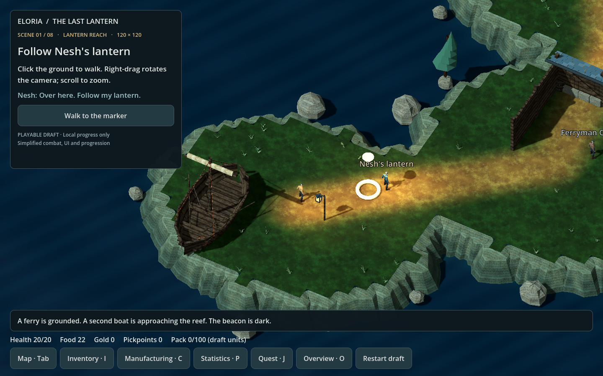
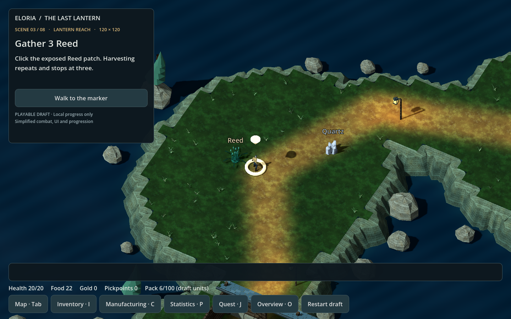
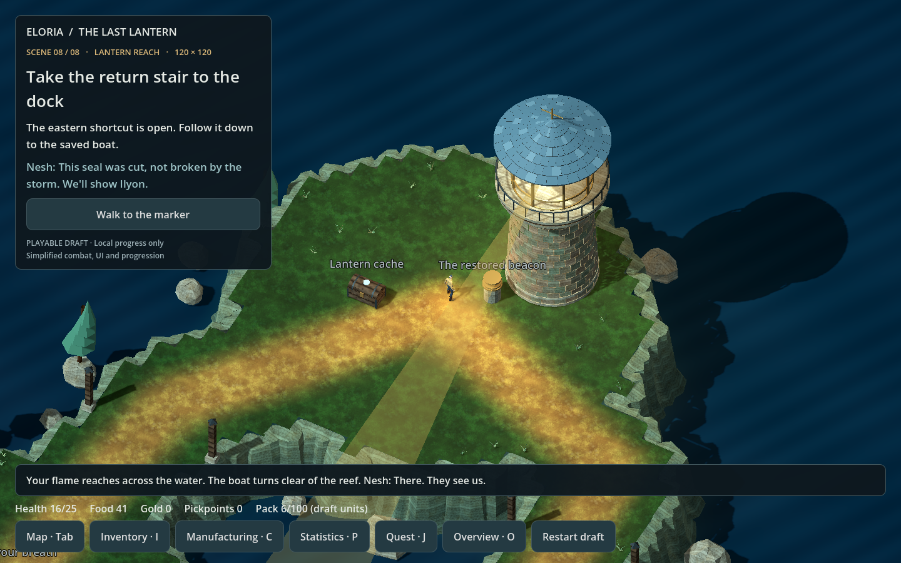

# Lantern Reach — coastal art pass

The playable draft now has a weathered coastal setting, with more detail at
the normal gameplay camera distance. The quest, collision grid, target
positions and approach tiles are unchanged from the reviewed draft.

## What changed

- A continuous terrain surface blends green grass into worn paths. Layered
  cliffs, shore rocks, wind pines and low grass give the island a coastline.
- Timber shelters have planked walls, braces, stone footings and slate roofs.
  Cutaway fronts keep the chart, caches and workbench visible.
- Both boats have curved planked hulls, ribs, thwarts, rigging, rope coils and
  oars. The grounded ferry has a furled sail; the rescued boat carries sail.
- The beacon has coursed masonry, a balcony, railings, optic rings and a slate
  roof. Restoring it lights the lantern and reveals a tapered beam.
- Clothed characters use idle, walking and attack animations. The native boar
  replaces the silhouette, and the harvest nodes use the game's Reed and
  Quartz models at their original quest coordinates.
- Framed lanterns, wood-and-iron caches, tools and dock furniture add detail.
  Animated water, shoreline foam, texture mipmaps and warm local lighting
  complete the pass. Tall path lanterns stay clear of interaction points.

## Sources and rebuilding

`art_authoring.py` contains the new procedural geometry. Materials reuse the
repository's Sunmane Steppe timber, stone, ground, canvas, textile and leather
textures. That map attributes its texture set to original Eloria work under
CC-BY-4.0.

The Reed, Quartz and wild boar GLBs are copied from the native client's assets.
The traveler uses the existing Luminous male model with selected clips from
the shared Universal Animation Library mapped to its named joints. The source
meshes and images are retained. This pass does not assign new licenses to
reused assets; retain their existing repository attribution.

`package/art.json` records source paths, source hashes and modifications.
Running `python build_map.py` regenerates the world and self-contained runtime
models from those sources. Playing the draft uses only the packaged files.

## Verification

- Seven package checks, including deterministic generation and exact hashes
  for the previously reviewed collision grid, quest and target layout.
- Eight full playthrough variants: 784 checks, no failures.
- UI interactions and window layout: 65 checks, no failures.
- Physics raycasts at all 15 interaction approaches; floor height, terrain
  colour blending and mipmaps verified.
- Ten rendered landmark views through the real Godot scene: 60 checks, no
  failures. Screenshots above were captured in the playable draft.

This remains a local prototype with simplified combat, UI and progression.
Characters share a model with different clothing colours; distinct outfits,
visible equipped weapons, companion staging, sound/weather and production
client/server integration remain future work.
