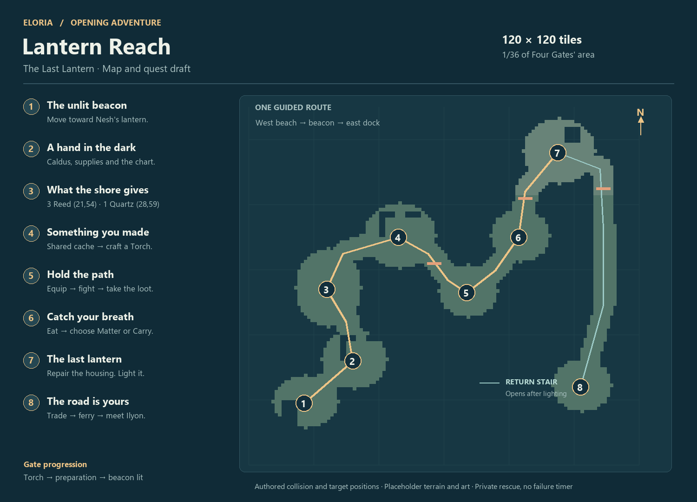

> Historical standalone prototype design. For the current, real-client implementation and launcher, see [README.md](README.md). The simulated rules and launch instructions below describe the earlier draft.

# The Last Lantern

A playable map and quest draft for Eloria's opening adventure. A storm has
grounded your ferry at Lantern Reach. Another boat is approaching the reef.
You help Nesh and Caldus restore the beacon, using the torch you make yourself.

**This is a separate, local Godot prototype.** It contains the complete rescue
sequence and a native map package. Combat, inventory windows, carrying weight,
food and progression are simplified simulations. It does not connect to the
game server, change a live character, register a production map or replace the
existing tutorial. The Four Gates transition is represented by a handoff card.

## Play the draft

Double-click `play.cmd`, or run `.\play.cmd` from this directory. It uses the
installed Godot executable, or one supplied with
`-Godot "C:/path/Godot.exe"`. The launcher allows the bundled PowerShell script
for that process only; it does not change your system's execution policy.

You can also launch the PowerShell script directly with:

```powershell
powershell.exe -NoProfile -ExecutionPolicy Bypass -File .\play.ps1
```

Alternatively, import
`project.godot` into Godot 4 and run the project. No asset downloads are needed.

| Control | Action |
| --- | --- |
| Click ground | Walk along a collision-checked route |
| Click an object or person | Approach, then interact |
| Right-drag / mouse wheel | Rotate camera / zoom |
| E or **Walk to the marker** | Approach the current objective |
| Tab / M | Map with the same objective marker |
| I / C / P / J | Inventory / manufacturing / statistics / quest log |
| O | Whole-island overview |
| Esc | Close the current window |

Progress saves automatically. Relaunching restores your exact objective,
inventory and island state. **Restart draft** starts a separate playthrough
from the ferry. When using `play.ps1`, saves stay under `.local/` in this
directory. The launcher isolates the prototype's Godot profile.

## The map



**120 × 120 one-metre tiles**, compared with Four Gates' 720 × 720 tile grid:
one sixth the width and one thirty-sixth the area. There are 2,816 walkable
tiles in eight pockets connected by a winding path. The remaining space is
water and impassable scenery. The coastal art pass adds textured grass and
worn paths, layered cliffs, timber shelters, slate roofs, detailed boats and
a stone beacon. It uses the project's textured characters, animated boar,
Reed and Quartz models. See the [art pass and screenshots](art-pass.md).

| Scene | Anchor | What gives the space its purpose |
| --- | --- | --- |
| 1. Grounded ferry | 17, 19 | Stranded hull, Nesh's lantern, first movement |
| 2. Boathouse | 32, 32 | Caldus, supplies and the keeper's wall chart |
| 3. Tidal garden | 24, 54 | Exposed Reed at **21,54**, Quartz at **28,59** |
| 4. Repair shed | 46, 70 | Shared cache, crafting stock, repair bench |
| 5. Causeway | 67, 53 | One novice encounter and space to retreat |
| 6. Beacon steps | 83, 70 | Safe recovery and a small build choice |
| 7. Lantern room | 95, 96 | Upper cache, broken housing, visible beacon |
| 8. Return dock | 102, 24 | Saved boat, galley trade, departure |

The causeway opens after crafting the Torch. The upper climb opens after food
and the attribute lesson. Lighting the beacon opens the eastern return stair,
which leads directly to the dock. These gates block real pathfinding cells,
so an early map click cannot bypass them.

Every quest stage refers to a target ID. That target supplies the resource or
interaction location, the walkable approach tile, the world label and the map
marker. Resource IDs and interactive IDs are unique. Both harvest patches have
open neighboring tiles; they are outside walls and roofs.

## The quest line

The 27 short objectives below form eight scenes. They update one persistent
instruction, rather than opening 27 separate dialogue boxes. Closing a window
leaves the next instruction and marker visible.

### 1 — The unlit beacon

**Objective:** Follow Nesh's lantern.

**Nesh:** “Over here. Follow my lantern.”

Click-to-move and camera controls become useful immediately. Reaching Nesh
changes the objective to Caldus in the boathouse. There is no failure timer.

### 2 — A hand in the dark

**Objectives:** Talk to Caldus → read the keeper's chart → open the map.

**Caldus:** “That boat will follow our light. There isn't a light.”

Choose “I'll get it burning” or “Tell me what to do.” Both accept the rescue;
Nesh's response differs. Caldus supplies a Sword, Shield, Pickaxe and three
Bread once. The chart describes the entire route in a few sentences. The
crafting materials are already waiting in the shared cache.

### 3 — What the shore gives

**Objectives:** Gather 3 Reed → mine 1 Quartz.

**Nesh:** “Reeds for the shutters. Quartz for the lantern. The shore kept enough.”

Only the active resource is marked. Harvesting repeats and stops at the quota.
Quartz requires the supplied Pickaxe. Tutorial resources cannot be farmed past
the quota. Harvest counts and partial progress survive a restart.

### 4 — Something you made

**Objectives:** Store Reed → store Quartz → withdraw a Wood Plank → withdraw
a Cloth Roll → withdraw a Hatchet → make a Torch.

**Nesh:** “The lantern upstairs uses the same cache seal. Leave the repair parts here.”

The recipe matches the current game: **1 Wood Plank + 1 Cloth Roll**, with a
**Hatchet** as a retained tool, and **1 food**. Nesh explicitly assists this first
attempt. The torch warms the nearby ground and the causeway opens. The recipe
cannot be repeated for additional assisted items.

### 5 — Hold the path

**Objectives:** Equip Sword → equip Shield → defeat the boar → collect its bag.

**Nesh:** “Shield up. I'll keep him clear.”

Click the boar to begin automatic combat. Clicking open ground disengages in
the draft. A losing attempt triggers Nesh's intervention: health is restored,
the encounter resets and supplies remain intact. The player still has to win.
Auto-gather and manual looting both advance and grant exactly one Raw Meat.

### 6 — Catch your breath

**Objectives:** Reach the landing → restore food to 35 or more → spend a
pickpoint on Matter or Carry.

**Nesh:** “Eat. You did the hard part.”

The encounter supplies one point in the prototype. Either build choice opens
the upper climb. Earlier equipment, food and point spending are recognized,
so the player is never asked to repeat an already completed lesson. Numerical
attribute effects and XP pacing remain placeholders for production tuning.

### 7 — The last lantern

**Objectives:** Withdraw Reed upstairs → withdraw Quartz → repair the housing
→ light the beacon with the crafted Torch.

**Caldus, below:** “The bell! They're nearly on the rocks!”

Repair consumes exactly three Reed and one Quartz. Lighting requires the Torch
the player crafted; it is kept. The lantern lights, its beam appears over the
water, and the saved boat moves toward the dock. The scene remains lit after
reloading. The grounded ferry stays on its original beach.

**Nesh:** “There. They see us.”

On the return route: “This seal was cut, not broken by the storm. We'll show
Ilyon.” This is a story hook, not another prerequisite.

### 8 — The road is yours

**Objectives:** Follow the return stair → sell Raw Meat → buy Bread → depart.

**Caldus:** “Fresh meat for the galley? Take bread for the crossing.”

The galley buys one Raw Meat for 10 gold once. Bread costs the game's existing
8-gold shop price, leaving two gold. A dock cache allows recovery of supplies
stored earlier. “Ready for Four Gates” finishes the draft; “One more look” lets
the player stay on the restored island.

**Reward:** Keeper of the First Light. **Next instruction:** Talk to Gate
Warden Ilyon. The handoff specifies carrying ordinary items forward once and
preventing the old introductory walkthrough from starting again.

## Review and integration boundaries

The target experience is **18–22 minutes**; this prototype deliberately has
faster movement, harvesting and combat, so that duration is not a measured
result. It is ready to review the route, objective flow and rescue structure.

Before making it the live onboarding path, connect these authored targets and
events to the production server's private map instances, inventory, storage,
manufacturing, combat, trade, quest log and marker handlers. Validate the native
map in the full client/server coordinate pipeline. Use server-authoritative
item transfers and an atomic, once-only completion reward. Preserve existing
characters' older tutorial progress.

The following storyboard elements still need production work: companion
movement and staging, storm audio/weather, a stronger opening sightline to the
beacon, character-specific outfits and equipment attachments, a proper cutscene or in-world
rescue sequence, normal game UI highlights, final progression tuning, explicit
skip onboarding, and reward-free replay. Local **Restart draft** is available
for design review; it is not the production replay feature.

Magic, research, ranging and summoning belong to optional follow-up adventures.
Player trading and social systems should appear after entering the shared world.

## Files and checks

- `build_map.py` is the authored source for the terrain, targets, gates and quest.
- `art_authoring.py` builds the coastal geometry and packages existing textures,
  models and selected animation clips.
- `art_runtime.gd` loads the models, plays animations and configures materials;
  `water.gdshader` provides animated water and shoreline foam.
- `package/world.glb` and `package/world.json` form a native map package.
- `package/models/` contains self-contained character, creature, resource,
  boat and gate GLBs; `package/art.json` records dressing and asset provenance.
- `package/collision.bin` is a half-metre EWCG-v2 grid.
- `package/lantern_reach.escg.gz` is the matching one-metre server grid.
- `package/layout.json` binds all target IDs to positions and approach tiles.
- `package/quest.json` contains every objective, hint, dialogue line and reward.
- `quest_state.gd` is the local quest simulation; `preview.gd` runs the draft.

Rebuild with `python build_map.py`. Check the package with
`python -m pytest tests/test_package.py`. Run the eight full quest paths with
`godot --headless --path . --script res://tests/playthrough.gd`.
`tests/ui_checks.gd` exercises the movement button, dialogue choices, inventory
row callbacks, repeated harvesting, storage controls and manufacturing, and
checks that every draft window fits the 1440 × 900 preview.

The playthrough checks cover both loot settings, both attribute choices, early
actions, quota limits, blocked gates, reachability, tool retention, a losing
combat attempt, shared storage, checkpoint reloads and once-only rewards.
`tests/grounding.gd` checks the imported floor beneath every interaction
approach and verifies the terrain's colour blend and texture mipmaps.
Rendered captures use `tests/capture.gd` or `tests/capture_art.gd`; they exercise
the real Godot scene and GLB import. These are draft checks, not a claim of
production integration. Rebuilding the art requires the source assets in this
repository; playing the generated package needs no external assets.
